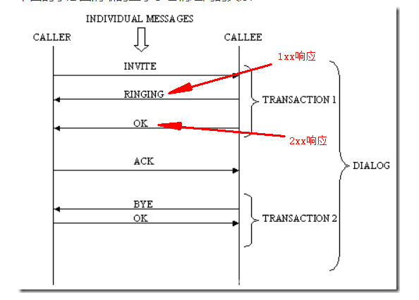
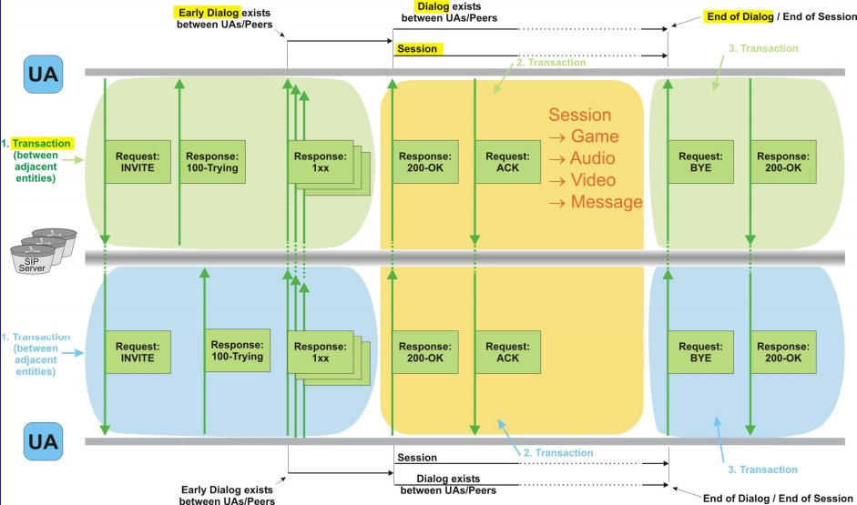

## SIP

### 概念

#### Message（消息）

消息是在服务器和客户端之间交换的独立文本, 有两种类型的消息,分别是*请求(Requests)和响应(Responses*)。

两种类型的消息都由一个起始行、一个或多个头字段、一个标识头字段结束的空行、一个可选的消息体组成。

#### Transaction（事务）

事务发生于客户端和服务器端之间,包含从客户端发出请求给服务器,到服务器响应给客户端的最终消息(non-1xx message)之间的所有消息(*也就是说，事务是一次完整的请求*)。

Branch是一个事务ID（Transaction ID），用于区分同一个Client所发起的不同Transaction。

#### Session（会话）

当一方发出请求，而另外一方或多方接受请求并通过信令交互成功后才能建立会话。**具体而言就是通过offer/answer方式交换sdp的媒体。**

一个会话由一个Call-ID, 一个local tag 和 一个remote tag来标识。

#### Dialog（对话）

一个对话由SIP消息建立，就像用2xx响应INVITE请求。**dialog的建立是客户端收到UAS的响应（To tag）时开始建立的。**收到180响应时建立dialog叫做早期对话（early dialog）,收到2XX的应答开始才是真正的dialog建立。

##### 会话与对话的区别

一次呼叫只能建立一次会话，但可以建立多个对话（Dialog），因为接受请求的可能不止一个。

#### Call（呼叫）

一个呼叫是由一个会议中被同一个发起者邀请加入的所有成员组成的。*一个 SIP 呼叫用全局唯一呼叫标识（CALL_ID）来识别。*因此，如果一个用户被不同的人邀请参加同一个多点会议，每个邀请都有一个唯一的呼叫。

Dialog、Call、Session 和 Transaction 关系图

Early dialog、Session、Dialog、Transaction等在一个 UA-UA 的呼叫中的体现

