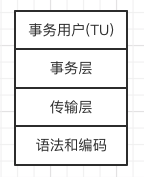
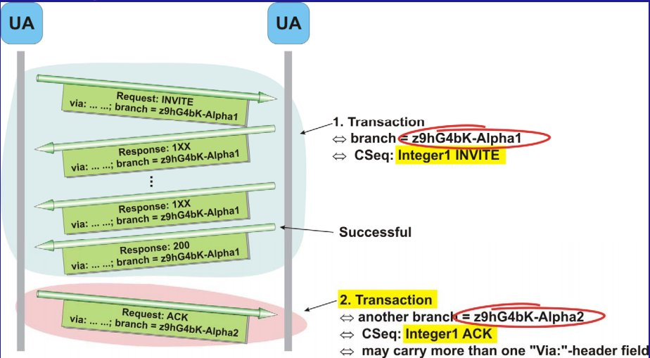
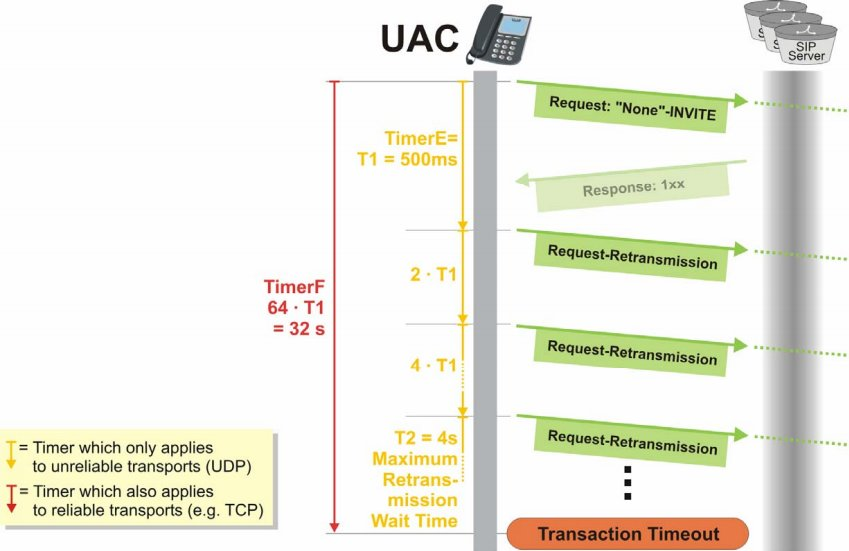
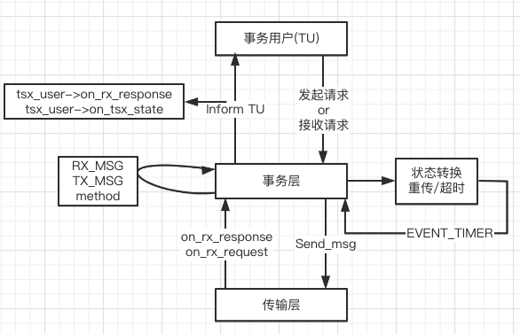

### SIP_Transaction



事务是一次完整的请求。处于信令层。

branch 是一个事务ID（Transaction ID ），用于区分同一个 Client 所发起的不同 Transaction。branch （遵循 RFC3261规范）参数的值必须用 magic cookie **"z9hG4bK"**打头。其它部分是对“To, From, Call-ID头域和Request-URI”按一定的算法加密后得到。

这7个字母是一个乱数cookie（定义成为7位的是为了保证旧s版本的RFC2543实现不会产生这样的值），这样服务器收到请求之后，可以很方便的知道这个branch ID是否由本规范所产生的（就是说，全局唯一的）。

branch值相同，代表同一个 transaction（事务）。

SIP是事务性的协议。事务的区分通过Via字段栈顶的Branch的值来确定，这是由于对于请求消息每经过一个有事务状态的Proxy的时候，该Proxy需要为这个事务创建一个服务器端事务和一个客户端事务，并且将自己的URI添加到Via的栈顶，并生成一个Global ID做为Branch的值，以此值来表示一个与之相对应的事务。SIP在事务层面定义了**状态机**和**定时器**来实现重传。

#### 分类

事务根据类型分为：

- Invite（邀请类型）

  Invite需要三次握手，所以需要的时间比较长。

- Non-Invite（非邀请类型）

  Non-Invite类型事务主要处理的是除Invite和ACK类型外的所有Sip信息。而Non-Ivite类型只需两次握手，要求回应时间短。

INVITE的地位比较重要， 所以需要这样一个三次握手的机制来保证会话的双方都能够确保事务的完整性。独立的ACK 的根本原因，这是因为ACK 涉及到了 UAC 和 UAS 直接重传机制的处理。个

##### 特别说明

非Invite里的ACK信息要处理的话就不属于事务处理的范围了，一般由程序自己把信息发送给传输层直接发送。

###### INVITE 事务三次握手



注意在上图这两个UA中，每一个代理服务器都将自己的地址加入返回的ACK的Via头域中，而非成功的transaction则不会加入。CSeq头域的值必须与INVITE相同，并且CSeq的方法必须是ACK。

**中间响应消息1xx的使用则是为了节省网络开销设计的，一旦 UC 收到任何一个中间响应消息，则UC必须停止消息重发定时器，不再从发这个请求消息，反之则直到收到最终响应消息或重发定时器超时。**一旦客户端UAC的事务在Calling状态收到任何中间响应消息1xx，事务则自动**切换到Processing状态，停止请求消息的重发**。并且需要将中间响应消息传送给TU事务用户。在呼叫业务中，TU以及上层应用可以根据中间响应消息在用户界面上提示用户。一旦事务切换到Processing状态，任何其他中间响应消息也都要传送给TU。

**注意，从INVITE到200OK都是一个事务(branck值相同)，而最后的确认消息ACK却是一个的单独的事务。后面的BYE到200OK又属于另一个新的事务。**

##### 非INVITE 两次握手



当UAC发出非INVITE请求时，它就会在事务管理子层上开启定时器F（TCP）或者是E（UDP），确保超时的时候进行重传。这适用于除了 ACK请求外的其他非INVITE请求。每次超时重传时E的时间都被翻倍，直到最大的4秒。而F超时时，UAC就会认为是Timeout，这个事务将被删除。

#### 生命周期

Transaction 包括一个请求和其触发的所有响应，包括若干暂时响应和一个最终响应。生命周期从请求产生到收到最终响应。

#### 事务状态的变迁

如果是 2xx 响应，SIP 事务 = 请求 + 对应响应

如果是非 2xx 响应，SIP 事务= 请求 + 对应响应 + ACK

UT = user transaction (用户处理)

CT = client transaction (sip dialog模块处理)

##### UAC 

calling

proceeding

compeleted

terminated

##### UAS

proceeding

compeleted

confirmed

terminated

##### invite session状态变迁

null ----> early stage ----> calling ----> confirmed ----> disconnect


### pjsip transaction

```c
tsx_state:
	PJSIP_TSX_STATE_NULL,					//UAC,发送任何请求之前		   NULL
	PJSIP_TSX_STATE_CALLING,				//uac,请求发送之后			CALLING
	PJSIP_TSX_STATE_TRYING,					//uas,接收请求之后			Trying
	PJSIP_TSX_STATE_PROCEEDING,				//uas/uac,临时响应			 Proceeding
	PJSIP_TSX_STATE_COMPLETED,				//uas/uac,最终响应			 Completed
	PJSIP_TSX_STATE_CONFIRMED,				//uas,接收ACK 之后			 Confirmed
	PJSIP_TSX_STATE_FERMINATED,				//销毁前					  Terminated
	PJSIP_TSX_STATE_DESTROYED,				//销毁					  Destroy
	PJSIP_TSX_STATE_MAX						//number of states
```

```
Transport flag:
	TSX_HAS_PENDING_TRANSPORT=1,
	TSX_HAS_PENDING_RESCHED=2,
	TSX_HAS_PENDING_SEND=4,
	TSX_HAS_PENDING_DESTROY=8,
	TSX_HAS_PENDING_SERVER=16,
```

```
Timeout valueL:
	t1 = 500ms,
	t2 = 4s,
	t4 = 5s,
	td = 32s,
	timeout = 32s
```

```
time flag:
	TIMER_INACTIVE 0
	RETRANSMIT_TIMER 1
	TIMEOUT_TIMER 2
	TRANSPORT_ERR_TIMER 3
```

两个时间：

- Time out 				超时时间
- retransmit time       重试时间

transaction key：

没有 branch （RFC2543）

​	c\$method.name\$cseq\$from.tag\$cid->id\$host->ptr(via header)\$send_by.port\$\0

含有 branch（RFC3261）

​	c/s \$method.name\$branch

结构：

​	hashtable 用于存储 transaction，key 为键值


transaction架构

