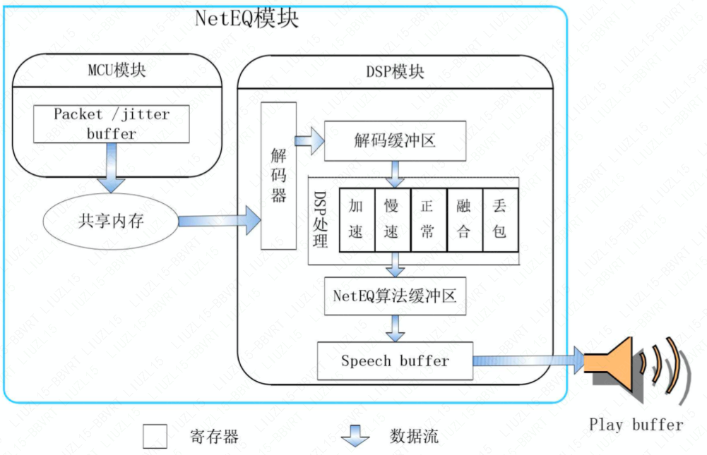
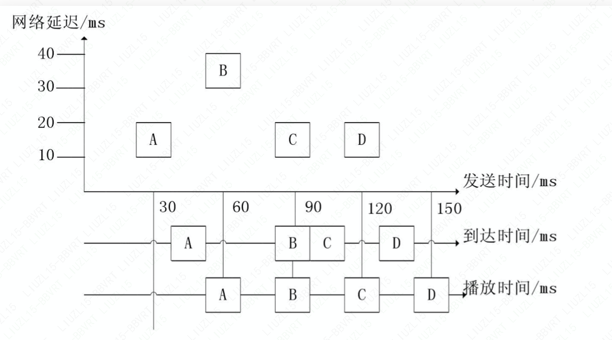

# NetEQ

在 NetEQ 模块中，又被大致分为 MCU（Micro Control Unit，微控单元） 模块和 DSP 模块。MCU 主要负责做**延时及抖动的计算统计，并生成对应的控制命令**。而 DSP 模块负责**接收并根据 MCU 的控制命令进行对应的数据包处理**，并传输给下一个环节。netEQ = jitter buffer + decoder + PCM信号处理



### 缓冲区

- decodedBuffer：用于放解码后的语音数据
- algorithmBuffer：用于放 DSP 算法处理后的语音数据
- speechBuffer：用于放将要播放的语音数据
- speechHistoryBuffer：用于放丢包补偿的历史语音数据，即靠这些数据来产生补偿的语音数据

## MCU 模块

- 网络延时统计算法
- 抖动延迟统计算法
- 控制命令决策判定

MCU 模块变量

|    变量     | 变量作用                                      |
| :---------: | --------------------------------------------- |
| availableTS | 表示packet buffer中能获得的有效包的起始时间戳 |
|             |                                               |
|             |                                               |
|             |                                               |
|             |                                               |


### Jitter Buffer

##### 两种模式

- 自适应的（adaptive）
- 固定的（fixed）

##### 生命周期的两种状态

- prefeching（预存取）
- processing（处理中）

只有在processing时才能从JB中取到语音帧。初始化时把状态置成prefetching，当在JB中的语音包个数达到指定的值时便把状态切到processing。如果从JB里取不到语音帧了，它将又回到prefetching。等buffer里语音包个数达到指定值时又重新回到processing状态。

##### 结构

为了便于处理，将包头和payload在buffer中分开保存，保存包头中相关属性的叫attribute buffer，保存payload的叫payload buffer。

RTP协议里sequence number数据类型是unsigned short，范围是0~65535，就存在从65535到0的转换，这增加了复杂度。对于收到的RTP包，首先要看它是否来的太迟（相对于上一个已经取出的包），太迟了就要把这个包主动丢弃掉。设上一个已经取出的包的sequence number为 last_got_senq，timestamp 为last_got_timestamp，当前收到的将要放的包的sequence number为 cur_senq，timestamp 为cur_timestamp，当前包的sequence number与上一个取走的sequence number的gap为delta_senq，则delta_senq可以根据下面的逻辑关系得到。

```c
if(cur_senq >= last_got_senq)
{
	if(cur_timestamp >= last_got_timestamp)
		delta_senq = cur_senq - last_got_senq;
	else if(cur_timestamp < last_got_timestamp)
		delta_senq = cur_senq - 65536 - last_got_senq;
}
else if(cur_senq < last_got_senq)
{
	if(cur_timestamp >= last_got_timestamp)
		delta_senq = cur_senq + 65536 - last_got_senq;
	else if(cur_timestamp < last_got_timestamp)
		delta_senq = cur_senq - last_got_senq;
}
```

对于收到的第一个包，它的位置（position，范围是0 ~ capacity-1）是sequence number % capacity。后面的包放的position依赖于它上一个已放好的包的position。设上一个已放好的包的sequence number为 last_put_senq，timestamp 为last_put_timestamp，position为last_put_position，当前收到的将要放的包的sequence number为 cur_senq，timestamp 为cur_timestamp，position为cur_position，当前的包的sequence number与上一个放好的sequence number的gap为delta_senq，则cur_position可以根据下面的逻辑关系得到。

```c
if(cur_senq >= last_put_senq)
{
	if(cur_timestamp >= last_put_timestamp)
		delta_senq = cur_senq - last_put_senq;
	else if(cur_timestamp < last_put_timestamp)
		delta_senq = cur_senq - 65536 -last_put_senq;
}
else if(cur_senq < last_put_senq)
{
	if(cur_timestamp >= last_put_timestamp)
		delta_senq = cur_senq + 65536 -last_put_senq;
	else if(cur_timestamp < last_put_timestamp)
		delta_senq = cur_senq - last_put_senq;
}
cur_position = (last_put_position + delta_senq + capacity) % capacity;
```

如果到某个位置时它的block里没有包，就说明这个包丢了，这时取出的就是payload大小就是0，告诉后续的decoder要做PLC。


JB初始化时会设定一个缓存包的个数值（叫prefetch），并处于prefetching状态，这种状态下是取不到语音帧的。JB里缓存包的个数到达设定的值后就会变成processing状态，同时可以从JB里取语音帧了。在通话过程中由于网络环境变得恶劣，GET的次数比PUT的次数多，GET完最后一帧就进入prefetching状态。当再有包PUT进JB时，先看前面共有多少次连续的GET，从而增大prefetch值，即增大buffer size的大小。如果网络变得稳定了，GET和PUT就会交替出现，当交替出现的次数达到一定值时，就会减小prefetch值，即减小buffer size的大小，交替的次数更多时再继续减小prefetch值。


**reset JB**

1. 当收到的语音包的媒体类型（G711/G722/G729，不包括SID/RFC2833等）变了，就认为来了新的stream，需要reset JB。
2. 当收到的语音包的SSRC变了，就认为来了新的stream，需要reset JB。
3. 当收到的语音包的packet time变了，就认为来了新的stream，需要reset JB。

**JB 统计信息**

1. JB当前运行状态：prefetching / processing
2. JB里有多少个缓存的包
3. 从JB中取帧的head的位置
4. 缓冲区的capacity是多少
5. 网络丢包的个数
6. 由于来的太迟而被主动丢弃的包的个数
7. 由于JB里已有这个包而被主动丢弃的包的个数
8. 进prefetching状态的次数（除了第一次）

#### 技术关键点

- 包处理 - 类型判断/分割为播放帧
- 乱序接收处理 - Sequence/Timestamp
- 抖动/延时统计值计算
- 取帧位置/容量变化 - 根据包接收的状况
- 音频参数切换 - Reset
- 丢包补偿 - 参考历史包进行重构

#### 抖动消除

同码率下：抖动（J） = 平均到达间隔（接近发送间隔） - 单次到达间隔

- J > 0：正抖动，数据包提前到达，包堆积，接收端溢出
- J < 0 ：负抖动，数据包延迟或丢包

由于网络包的到达有快有慢，导致间隔不一致，这样听感就不顺畅。而抖动消除就是使不统一的延迟变为统一的延迟，**所有数据包在网络传输的延迟之和与抖动缓冲区处理后的延迟之和相等**。



常见的抖动缓冲控制算法有两种：

- 静态抖动缓冲控制算法：缓冲区大小固定，容易实现，网络抖动大时，丢包率高，抖动小时，延迟大。
- 自适应抖动缓冲控制算法：计算目前最大抖动，调整缓冲区大小，实现复杂，网络抖动大时，丢包率低，抖动小时，延迟小。

好的算法自然是追求低丢包率和低延迟。

#### 网络延时统计算法

[webRTC中音频相关的netEQ（三）：存取包和延时计算](https://www.cnblogs.com/talkaudiodev/p/9231526.html)

### 控制命令决策判断

|          |          MCU控制命令          |         DSP处理命令         |
| -------- | :---------------------------: | :-------------------------: |
| 正常播放 |      BUFSTATS_DO_NORMAL       |      DSP_INSTR_NORMAL       |
| 加速播放 |    BUFSTATS_DO_ACCELERATE     |    DSP_INSTR_ACCELERATE     |
| 减速播放 | BUFSTATS_DO_PREEMPTIVE_EXPAND | DSP_INSTR_PREEMPTIVE_EXPAND |
| 丢包补偿 |      BUFSTATS_DO_EXPAND       |      DSP_INSTR_EXPAND       |
| 融合     |       BUFSTATS_DO_MERGE       |       DSP_INSTR_MERGE       |

MCU模块给DSP模块发什么样的控制命令首先取决于当前帧和前一帧的接收情况。

1. 当前帧接收正常，但前一帧丢失。如果前一帧丢失，但当前帧接收正常，说明前一帧是通过丢包补偿生成的。为了使前一帧由丢包补偿生成的数据和当前没有丢包的帧的数据保持语音连续，需要根据前后帧的相关性做平滑处理。这种情况下MCU模块会发正常播放、融合两种控制命令中的一个给DSP。DSP模块先对当前帧解码，然后解码后的数据会根据命令做相应的处理。
2. 当前帧丢失或延迟，前一帧同样丢失或延迟。MCU模块会连续的发丢包补偿命令给DSP，DSP模块也会连续的进入丢包补偿单元来生成补偿数据。不过越到后面生成的补偿数据效果越差。

##### 加速播放（3个条件）

1. playedOutTS = availableTS

2. 上一帧播放模式不为丢包补偿

3. 第三个条件是下列两个之一：

   1.  buffLevelFilt >= max( optBufLevel, (3*optBufLevel)/4 + (160/sample_per_packet) * (sample_rate/8000)) 且 timescaleHoldOff == 0

      其中sample_rate为采样率，如8000/16000。samples_per_packet为每个包的采样点数，以16KHZ/每包20ms为例，samples_per_packet就为320。 timescaleHoldOff初始化为32，且每发生一次加速或减速播放就右移一位。此参数是为了防止连续的加速或减速播放恶化人耳的听觉感受。

   2. buffLevelFilt >= 4* optBufLevel

**加速处理**

1. 看decodedBuffer里是否有30Ms的语音数据（语音数据量要大于等于30Ms才能做加速处理），如果没有就需要向speechBuffer里未播放的语音数据借，使满足大于等于30Ms的条件。

   先算出decodedBuffer里缺的样本数（记为nsamples, 等于30Ms的样本数减去buffer里已有的样本数），即需要向speechBuffer借的样本数。然后在decodedBuffer里将已有的样本数右移nsamples，同时从speechBuffer里end处开始取出nsamples个样本，将其放在decodedBuffer里开始处空出来的地方。

2. 做加速算法处理，输入是decodedBuffer里的30Ms语音数据，输出放在algorithmBuffer里。如果压缩后的样本数小于向speechBuffer借的样本个数nsamples(假设小msamples)，不仅要把这些压缩后的样本拷进speechBuffer里(从end位置处向前放)，同时还要把从cur到pos处的样本数向后移msamples，cur指针也向后移msamples个数。

   如果压缩后的样本数大于向speechBuffer借的样本个数(假设大qsamples)，先要把从cur到pos处的样本数向前移qsamples（cur和pos指针都要向前移qsamples个数），然后把这些压缩后的样本拷进speechBuffer里(从pos位置处向后放)。

3. 从speechBuffer里取出一帧语音数据播放，同时把cur指针向后移一帧的位置。

##### 减速播放

1. playedOutTS = availableTS
2. 上一帧播放模式不为丢包补偿
3. buffLevelFilt < (3*optBufLevel)/4 且 timescaleHoldOff == 0

**伪代码**

```
If（playedOutTS == availableTS）
{
	If（上一帧播放模式不为丢包补偿）
	{
		If（加速播放第三个条件是下列之一 || 加速播放第三个条件是下列之二）
			return 加速播放；
		If（减速播放第三个条件）
			return 减速播放；
	}
	return 正常播放；
}
```

##### 丢包补偿场景

1. availableTS = 0，即packet buffer为空，显然这时需要做丢包补偿。
2. playedOutTS < availableTS，即要播放的包丢失或者延时到，但是packet buffer里有缓冲包，需要满足下面两个条件之一即可：
   1. 上一帧播放模式不为丢包补偿
   2. 上一帧播放模式为丢包补偿，且前面几帧均为丢包补偿，这是连续丢包的场景，这时要看连续丢包补偿的次数。netEQ设定最多可以补偿100ms的数据，以每包20ms为例，最多可以补偿5个包，其实100ms后的补偿效果也不好了。所以连续丢包补偿的次数小于5的话，还会继续丢包补偿，否则就不做丢包补偿了。

##### 融合的条件

1. playedOutTS < availableTS （此式也表示packet buffer不为空，为空时availableTS = 0）
2. 上一帧的处理模式为丢包补偿

## DSP处理

- 变速不变调

  ​	WSOLA 算法

- 正常

- 加速

- 减速

- 融合

- 丢包补偿

DSP 模块变量

| 变量        | 变量作用                        |
| ----------- | ------------------------------- |
| playedOutTS | 表示已经播放到的PCM数据的时间戳 |
|             |                                 |
|             |                                 |
|             |                                 |
|             |                                 |


#### 融合

当上一次播放的帧与当前解码的帧不是连续的情况下，需要来衔接和平滑一下。

#### PLC

丢包补偿（PLC，Packet Loss Concealment）。主要分为发送端的接受端的丢包补偿。

##### 发送端

- 主动重传：通过信令，让发送端重新补发。
- 被动通道编码：在组包时做一些特殊处理，丢包时可以作依据。
  - 前向差错纠正（FEC，Forward error correction）：根据丢包前面的包信息来进行处理。
    - 媒体相关：双发，数据包中第二个包一般用较低码率和音质编码的包。
    - 媒体无关：每 n 个数据包生成一个（多个）新的校验包，校验包能还原出这 n 个包的信息。
  - 交织：对数据包分割重排，减少单次丢包的数据量大小。

##### 接收端

- 插入：用固定的包进行补偿
  - 静音包
  - 噪音包
  - 重复包
- 插值：模式匹配及插值技术生成相似的包，算法不会理解数据包具体内容，而只是从数据特征上进行处理
- 重构：根据编码参数和压缩参数生成包，与插值不同，算法使用更多数据包的信息，效果更好

##### 丢包补偿处理

1. 基于speechHistoryBuffer利用丢包补偿算法生成补偿的语音数据（记样本数为nsamples）放在algorithmBuffer里，同时还要更新speechHistoryBuffer里的数据为下次做丢包补偿做准备。

   先把speechHistoryBuffer里的数据左移nsamples，然后把algorithmBuffer里的nsamples个样本放在speechHistoryBuffer的尾部。

2. 把algorithmBuffer里生成的数据放到speechBuffer里。

   先将speechBuffer里的数据左移nsamples，然后把algorithmBuffer里的nsamples个样本放在speechBuffer的尾部，同时cur指针也要左移nsamples。

3. 从speechBuffer里取出一帧语音数据播放，同时把cur指针向后移一帧的位置。

### 缓冲区

- 抖动缓冲区
- 解码缓冲区
- 算法缓冲区
- 语音缓冲区

### 进包处理

总体流程如下：

1. 将数据放入局部变量 PacketList 中
2. 处理 RTP 包逻辑
   - 转换内外部时间戳
   - NACK（否定应答） 处理
   - 判断冗余大包（RED）并解为小包
   - 检查包类型
   - 判断并处理 DTMF（双音多频） 包
   - 带宽估算
3. 分析包
   - 去除噪音包
   - 解包头获取包的信息
   - 计算除纠错包和冗余包以外的正常语音包数量
4. 将语音包插入 PacketBuffer（抖动缓冲区）


### 出包处理

总体流程如下：

1. 检查静音状态，直接返回静音包
2. 根据当前帧和前一帧的接收情况获取控制命令决策
3. 若非丢包补偿，进行解码，放入解码缓冲区
4. 进行静音检测（Vad）
5. 根据命令决策，将解码缓冲区进行处理，放到算法缓冲区（AudioMultiVector）
6. 将算法缓冲区的数据拷贝到语音缓冲区（SyncBuffer）
7. 处理并取出 10ms 的语音数据输出


### 附

Q 格式：定点数中最高位表示符号位，符号位右边 n 位表示整数，剩下的表示小数。 Qₘ.ₙ ，m 为整数，n 为小数，共  m+n+1。

代码中如遇到要做浮点运算，要用 Q 格式定点化去算，而不是直接用浮点数去运算。

Jitter Buffer 中计算网络延时和抖动缓冲延时使用的就是 Q 格式。