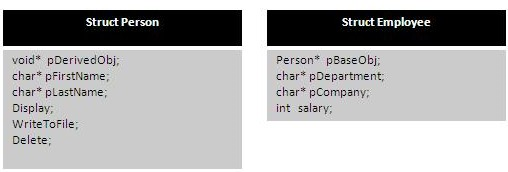
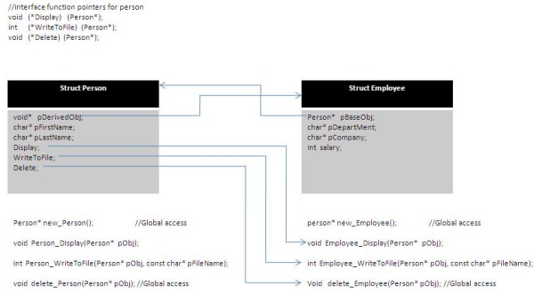

C语言继承与多态

**相关项目见  /sample/C_继承与多态/**

### 类的实现

在C中表示上面的类，我们可以使用结构体，并用操作结构体的函数表示成员函数。

为了实现封装，即绑定数据、函数、函数指针。我们需要创建一个函数指针表。构造函数new_Person()将设置函数指针值以指向合适的函数。这个函数指针表将作为对象访问函数的接口。

```c
//Person.h
typedef struct _Person  Person;

//declaration of pointers to functions
typedef void    (*fptrDisplayInfo)(Person*);
typedef void    (*fptrWriteToFile)( Person*, const char*);
typedef void    (*fptrDelete)( Person *) ;

//Note: In C all the members are by default public. We can achieve 
//the data hiding (private members), but that method is tricky. 
//For simplification of this article
// we are considering the data members     //public only.
typedef struct _Person 
{
    char* pFName;
    char* pLName;
    //interface for function
    fptrDisplayInfo   Display;
    fptrWriteToFile   WriteToFile;
    fptrDelete      Delete;
}Person;		//类的表示，函数指针为成员函数

person* new_Person(const char* const pFirstName, const char* const pLastName); 
//constructor，构造函数，需额外定义
void delete_Person(Person* const pPersonObj);    
//destructor，析构函数，需额外定义

//成员函数，指定函数指针，访问成员函数需要携带对象
void Person_DisplayInfo(Person* const pPersonObj);
void Person_WriteToFile(Person* const pPersonObj, const char* pFileName);
```

new_Person()函数作为构造函数，它返回新创建的结构体实例。它初始化函数指针接口去访问其它成员函数。

### 继承的实现

在C中，继承可以通过在派生类对象中维护一个基类对象的引用来完成。



```c
struct Employee employee
{
    Person* mBaseObj;
    char* pDepartment;
    char* pCompany;
    int salary;
};
```

### 多态的实现



为了实现多态，基类对象应该能够访问派生类对象的数据。为了实现这个，基类应该有访问派生类的数据成员的权限。

```c
struct Person
{
    void* pDrivedObj;
    char* pFirstName;
    char* pLastName;
    fptrDisplayInfo   Display;
    fptrWriteToFile   WriteToFile;
    fptrDelete      Delete;
};
```

```c
struct Employee
{
    Person* mBaseObj;
    char* pDepartment;
    char* pCompany;
    int salary;
};
```

在基类对象中，函数指针指向自己的虚函数。在派生类对象的构造函数中，我们需要使基类的接口指向派生类的成员函数。这使我们可以通过基类对象（多态）灵活的调用派生类函数。