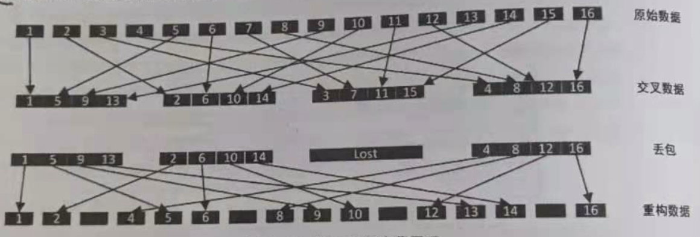

## NetEQ

抖动处理的的**核心思想**是**增加消抖缓冲区消除网络抖动对语音质量的影响**，以使听到的声音是流畅的。这一模块在WebRTC中被称为NeEQ, NetEQ 采用动jitterbuffer技术，在延迟和丢包之间自适应平衡。

**NetEQ主要由自适应缓冲器(adaptive packet buffer)、语音解码器( speech decoder )、抖动控制和丢包隐藏(jitter buffer and error concealment)以及播放(Play out)组成**。抖动控制是该算法的核心之一，**丢包隐藏**(又称丟包补偿 PLC)**分为发送端和接收端两种实观方式**，基于**发送端**的方式包括**前向纠错/交织和重传**方法，基于**接收端**的方式包括**插入、重构和插值**方法。
插入丢包隐藏原理如下图所示。

**MCU模块**的 jitterbufufer 在代码中的命名是 packet_buffer_ 。MCU主要用于向packet_buffer_ 插入解析后的RTP包和从packet_buffer_ **取数据给DSP模块**，DSP 模块会执行解码，解码后的数据放在 decoded_buffer 里。此外**MCU**还**会计算网络延迟( TargetLevel )和抖动缓冲延迟( BuferLevelFilter)**,将**延迟情况**以及**上一帧对播放数据的操作**汇总到**决策逻辑**(代码实现中的DecisionLogic 类)其根据**网络状况**、**缓冲区中未处理的数据包长度**，以及**等待播放的语音长度**等参数取DSP处理的五种操作中的一种操作执行(**加速、慢速、正常、融合、丢包**)。

NetEQ 可以实时处理抖动延迟。

### 抖动和收包

抖动控制和丢包隐藏主要由扩展、正常以及加速三部分组成。

- 扩展(expand)：变长不变调，将语音时长拉长
- 正常(nomnal)：正常播放，无抖动网络情况正常
- 加速(accelerate)：加速，对语音信号处理实现快速播放，同样是变速不变调

NetEQ定义了以下4种收包情况。

1. 过去和当前帧均正确接收到
   MCU模块在正常播放、加速播放和减速播放三种操作中做出选择。

2. 仅当前帧发生丢包或延迟
   调用PLC单元重建LPC系数和残差信号，进行丢包隐藏的扩展操作。NetEQ
   最多为延迟和丢包帧**等待100ms**，超过该时间则直接提取下一帧播放。

3. 连续多帧丢包
   短时**多次调用PLC单元**，则短时平稳性条件可能不再满足，采用**逐帧递减能量增益方法**补偿丢包以避免引入更大的失真。

4. 前一帧丢失，当前帧正常
   NetEQ 会做出**正常播放和融合**操作响应。

对于丢包情况，其执行的命令由**MCU**模块**发出**，由**DSP**模块**执行**。

当 NetEQ 接收到延迟超过 3.75s 的数据包时，会造成 packet buffer 状态重启

