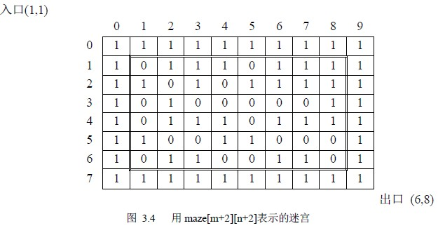
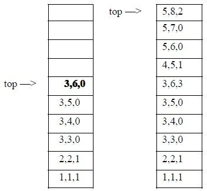

## 栈

**栈是限制在表的一端进行插入和删除的线性表。**允许插入、删除的这一端称为栈顶，另一个固定端称为栈底。当表中没有元素时称为空栈。栈又称为后进先出的线性表（Last In First Out），简称LIFO 表。

#### 栈常见的运算

- 栈初始化

  初始条件：栈 s 不存在

  操作结果：构造了一个空栈

- 栈判空

  初始条件：栈 s 已存在

  操作结果：若s 为空栈返回为1，否则返回为0。

- 入栈

  初始条件：栈s 已存在
  操作结果：在栈s 的顶部插入一个新元素x， x 成为新的栈顶元素。栈发生变化。

- 出栈

  初始条件：栈s 存在且非空
  操作结果：栈s 的顶部元素从栈中删除，栈中少了一个元素。栈发生变化。

- 读栈顶元素

  初始条件：栈s 存在且非空
  操作结果：栈顶元素作为结果返回，栈不变化。

### 栈的应用举例

##### 数制转换问题

##### 迷宫求解

设迷宫为m 行n 列，利用maze\[m]\[n]来表示一个迷宫，maze[i][j]=0 或1; 其中：0 表示通路，1 表示不通，当从某点向下试探时，中间点有8 个方向可以试探，（见图3.4）而四个角点有3 个方向，其它边缘点有5 个方向，为使问题简单化我们用maze\[m+2]\[n+2]来表示迷宫，而迷宫的四周的值全部为1。这样做使问题简单了，每个点的试探方向全部为8，不用再判断当前点的试探方向有几个，同时与迷宫周围是墙壁这一实际问题相一致。

###### 迷宫求解算法思想
1. 栈初始化;

2. 将入口点坐标及到达该点的方向（设为－１）入栈

```
while (栈不空)
{
	栈顶元素＝＞（x , y , d）
	出栈;
	求出下一个要试探的方向d++ ;
	while （还有剩余试探方向时）
	{ 
		if （d 方向可走）
		则{ 
			x , y , d）入栈;
			求新点坐标(i, j ) ;
			将新点（i , j）切换为当前点（x , y）;
			if ( (x ,ｙ)= =(ｍ,n) ) 
				结束;
			else 
				重置d=0 ;
		}
		else 
			d++ ;
	}
}
```


###### 关键点

回溯法：是一种不断试探且及时纠正错误的搜索方法

1. 表示迷宫的数据结构

   表示的迷宫是一个6×8 的迷宫。入口坐标为（1，1），出口坐标为（m，n）

   

   ```c
   #define m 6 /* 迷宫的实际行*/
   #define n 8 /* 迷宫的实际列*/
   int maze [m+2][n+2] ;
   ```

   

2. 试探方向

   探顺序规定为：从当前位置向前试探的方向为从正东沿顺时针方向进行。为了简化问题，方便的求出新点的坐标，将从正东开始沿顺时针进行的这8 个方向的坐标增量放在一个结构数组move [ 8 ]中，在move 数组中，每个元素有两个域组成，x：横坐标增量，y：纵坐标增量。

   ```c
   typedef struct
   { int x，y
   } item ;
   item move[8] ;
   ```

   

3. 栈的设计

   当到达了某点而无路可走时需返回前一点，再从前一点开始向下一个方向继续试探。因此，压入栈中的不仅是顺序到达的各点的坐标，而且还要有从前一点到达本点的方向。

   

   栈中每一组数据是所到达的每点的坐标及从该点沿哪个方向向下走的，对于图3.4 迷宫，走的路线为：(1,1)1􀃆(2,2)1􀃆(3,3)0􀃆(3,4)0􀃆(3,5)0􀃆(3,6)0（下脚标表示方向），当从点(3,6)沿方向0 到达点(3,7)之后，无路可走，则应回溯，即退回到点(3,6)，对应的操作是出栈，沿下一个方向即方向1 继续试探，方向１、２试探失败，在方向３上试探成功，因此将(3,6,3)压入栈中，即到达了（4,5）点。

   ```c
   typedef struct
   {
       int x , y , d ;/* 横纵坐标及方向*/
   }datatype ;
   ```

   

4. 如何防止重复到达某点

   如何防止重复到达某点，以避免发生死循环：一种方法是另外设置一个标志数组mark\[m]\[n]，它的所有元素都初始化为0，一旦到达了某一点( i , j )之后，使mark\[i]\[j] 置1，下次再试探这个位置时就不能再走了。另一种方法是当到达某点（i , j）后使maze\[i]\[j] 置-1，以便区别未到达过的点，同样也能起到防止走重复点的目的，本书采用后者方法，算法结束前可恢复原迷宫。

###### 示例

见 迷宫求解.c

##### 表达式求值

正确的处理过程是：需要两个栈：对象栈s1 和算符栈s2。当自左至右扫描表达式的每一个字符时，若当前字符是运算对象，入对象栈，是运算符时，若这个运算符比栈顶运算符高则入栈，继续向后处理，若这个运算符比栈顶运算符低则从对象栈出栈两个运算量，从算符栈出栈一个运算符进行运算，并将其运算结果入对象栈，继续处理当前字符，直到遇到结束符。
