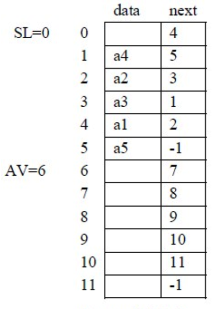

## 线性表

线性表是最简单、最基本、也是最常用的一种线性结构。它有两种存储方法：顺序存储和链式存储，它的主要基本操作是插入、删除和检索等。

#### 定义

线性表是具有相同数据类型的n(n>=0)个数据元素的有限序列，通常记为：

(a1，a2，… ai-1，ai，ai+1，…an)

其中n为表长， n＝0 时称为空表。
表中相邻元素之间存在着顺序关系。将ai-1 称为ai 的直接前趋，ai+1 称为ai 的直接后继。就是说：对于ai，当i=2，...，n 时，有且仅有一个直接前趋ai-1.，当i=1，2，...，n-1 时，有且仅有一个直接后继ai+1，而a1 是表中第一个元素，它没有前趋，an 是最后一个元素无后继。

#### 线性表的基本操作

每一个操作的具体实现只有在确定了线性表的存储结构之后才能完成。

###### 线性表初始化

初始条件：表L不存在操作结果：构造一个空的线性表

###### 求线性表的长度

初始条件：表L存在
操作结果：返回线性表中的所含元素的个数

###### 取表元

初始条件：表L存在且1<=i<=Length_List(L)
操作结果：返回线性表L中的第ｉ个元素的值或地址

###### 按值查找

初始条件：线性表L存在
操作结果：在表L中查找值为ｘ的数据元素，其结果返回在L中首次出现的值为ｘ的那个元素的序号或地址，称为查找成功; 否则，在L中未找到值为ｘ的数据元素，返回一特殊值表示查找失败。

###### 插入操作

初始条件：线性表L存在，插入位置正确(1<=i<=n+1,ｎ为插入前的表长)。
操作结果：在线性表L的第i 个位置上插入一个值为x 的新元素，这样使原序号为i , i+1, ... , n 的数据元素的序号变为i+1,i+2, ... , n+1，插入后表长=原表长+1。

###### 删除操作

初始条件：线性表L存在，1<=i<=n。
操作结果：在线性表L中删除序号为i的数据元素，删除后使序号为i+1, i+2,..., n的元素变为序号为i, i+1,...,n-1，新表长＝原表长－１。

### 顺序表

线性表的顺序存储是指在内存中用地址连续的一块存储空间顺序存放线性表的各元素，用这种存储形式存储的线性表称其为顺序表。因为内存中的地址空间是线性的，因此，用物理上的相邻实现数据元素之间的逻辑相邻关系是既简单，又自然的。

#### 特点

顺序表具有按数据元素的序号随机存取的特点。

#### 应用举例

### 链表

#### 单链表

链表是通过一组任意的存储单元来存储线性表中的数据元素的。

为建立起数据元素之间的线性关系，对每个数据元素ai，除了存放数据元素的自身的信息ai 之外，还需要和ai一起存放其后继ai+1 所在的存贮单元的地址，这两部分信息组成一个“结点”。

存放数据元素信息的称为数据域，存放其后继地址的称为指针域。因此n个元素的线性表通过每个结点的指针域拉成了一个“链子”，称之为链表。因为每个结点中只有一个指向后继的指针，所以称其为单链表。

```c
typedef struct node
{
    datatype data;
    struct node *next;
}LNode,*LinkList;
```

定义头指针变量

```c
LinkList H;
```

通常我们用“头指针”来标识一个单链表，如单链表L、单链表H等，是指某链表的第一个结点的地址放在了指针变量L、H 中， 头指针为“NULL”则表示一个空表。

#### 基本运算

###### 插入节点建立链表

头结点的加入使得“第一个结点”的问题不再存在，也使得“空表”和“非空表”的处理成为一致。

###### 求表长

不带头结点的单链表空表情况要单独处理，而带上头结点之后则不用了。

###### 查找

###### 插入

###### 删除

#### 循环链表

对于单链表而言，最后一个结点的指针域是空指针，如果将该链表头指针置入该指针域，则使得链表头尾结点相连，就构成了单循环链表。

##### 特点

单循环链表则可以从表中任意结点开始遍历整个链表，不仅如此，有时对链表常做的操作是在表尾、表头进行，此时可以改变一下链表的标识方法，不用头指针而用一个指向尾结点的指针R 来标识，可以使得操作效率得以提高。

#### 双向链表

```c
typedef struct dlnode
{
    datatype data;
    struct dlnode *prior,*next;
}DLNode,*DLinkList;
```

#### 静态链表

其中链表SL是一个带头结点的单链表，表示了线性表(a1, a2, a3, a4, a5)，而另一个单链表AV是将当前sd 中的空结点组成的链表。



数组 sd 的定义如下：

```c
#define MAXSIZE ...		//足够大的数
typedef struct
{
    datatype data;
    int next;
}SNode;	//节点类型
SNode sd[MAXSIZE];
int SL,AV;	//两个头指针变量
```

这种链表的结点中也有数据域data和指针域next，与前面所讲的链表中的指针不同的是，这里的指针是结点的相对地址(数组的下标)，称之为静态指针，这种链表称之为静态链表，空指针用-1表示，因为上面定义的数组中没有下标为-1的单元。

SL是用户的线性表，AV模拟的是系统存储池中空闲结点组成的链表，当用户需要结点时，例如向线性表中插入一个元素，需自己向AV申请，而不能用系统函数malloc来申请，相关的语句为：

```c
if(AV != -1)
{
    t = AV;
    AV = sd[AV].next;
}
```

所得到的结点地址(下标)存入了t 中；不难看出当AV表非空时，摘下了第一个结点给用户。当用户不再需要某个结点时，需通过该结点的相对地址t 将它还给AV，相关语句为： sd[t].next=AV;AV=t;而不能调用系统的free 函数。交给AV表的结点链在了AV的头部。

### 顺序表和链表的比较

#### 顺序表

##### 优点

- 方法简单，各种高级语言中都有数组，容易实现。
- 不用为表示结点间的逻辑关系而增加额外的存储开销。
- 顺序表具有按元素序号随机访问的特点。

##### 缺点

- 在顺序表中做插入删除操作时，平均移动大约表中一半的元素，因此对n较大的顺序表效率低。
- 需要预先分配足够大的存储空间，估计过大，可能会导致顺序表后部大量闲置；预先分配过小，又会造成溢出。

#### 链表

链表的优缺点恰好与顺序表相反。

链表的存储密度较低，存储密度是指一个结点中数据元素所占的存储单元和整个结点所占的存储单元之比。

#### 选取存储结构

选取结构的以下几点考虑：

1. 基于存储的考虑
2. 基于运算的考虑
3. 基于环境的考虑

### 相关特性

#### 鲁棒性

综合上面讨论的两种基本操作，链表操作时的鲁棒性问题主要包含两个情况：

- 当访问链表中某个节点 curt.next 时，一定要先判断 curt 是否为 null。
- 全部操作结束后，判断是否有环；若有环，则置其中一端为 null。

#### Dummy Node

Dummy node 是链表问题中一个重要的技巧，中文翻译叫“哑节点”或者“假人头结点”。

Dummy node 是一个虚拟节点，也可以认为是标杆节点。Dummy node 就是在链表表头 head 前加一个节点指向 head，即 dummy -> head。Dummy node 的使用多针对单链表没有前向指针的问题，保证链表的 head 不会在删除操作中丢失。除此之外，还有一种用法比较少见，就是使用 dummy node 来进行head的删除操作，比如 Remove Duplicates From Sorted List II，一般的方法current = current.next 是无法删除 head 元素的，所以这个时候如果有一个dummy node在head的前面。

所以，当链表的 head 有可能变化（被修改或者被删除）时，使用 dummy node 可以很好的简化代码，最终返回 dummy.next 即新的链表。

- 


### 经典用法

#### 反转链表

链表的基本形式是：`1 -> 2 -> 3 -> null`，反转需要变为 `3 -> 2 -> 1 -> null`。这里要注意：

- 访问某个节点 curt.next 时，要检验 curt 是否为 null。
- 要把反转后的最后一个节点（即反转前的第一个节点）指向 null。

#### 快慢指针

快慢指针也是一个可以用于很多问题的技巧。所谓快慢指针中的快慢指的是指针向前移动的步长，每次移动的步长较大即为快，步长较小即为慢，常用的快慢指针一般是在单链表中让快指针每次向前移动2，慢指针则每次向前移动1。快慢两个指针都从链表头开始遍历，于是快指针到达链表末尾的时候慢指针刚好到达中间位置，于是可以得到中间元素的值。快慢指针在链表相关问题中主要有两个应用：

- 快速找出未知长度单链表的中间节点 设置两个指针 `*fast`、`*slow` 都指向单链表的头节点，其中`*fast`的移动速度是`*slow`的2倍，当`*fast`指向末尾节点的时候，`slow`正好就在中间了。
- 判断单链表是否有环 利用快慢指针的原理，同样设置两个指针 `*fast`、`*slow` 都指向单链表的头节点，其中 `*fast`的移动速度是`*slow`的2倍。如果 `*fast = NULL`，说明该单链表 以 `NULL`结尾，不是循环链表；如果 `*fast = *slow`，则快指针追上慢指针，说明该链表是循环链表。