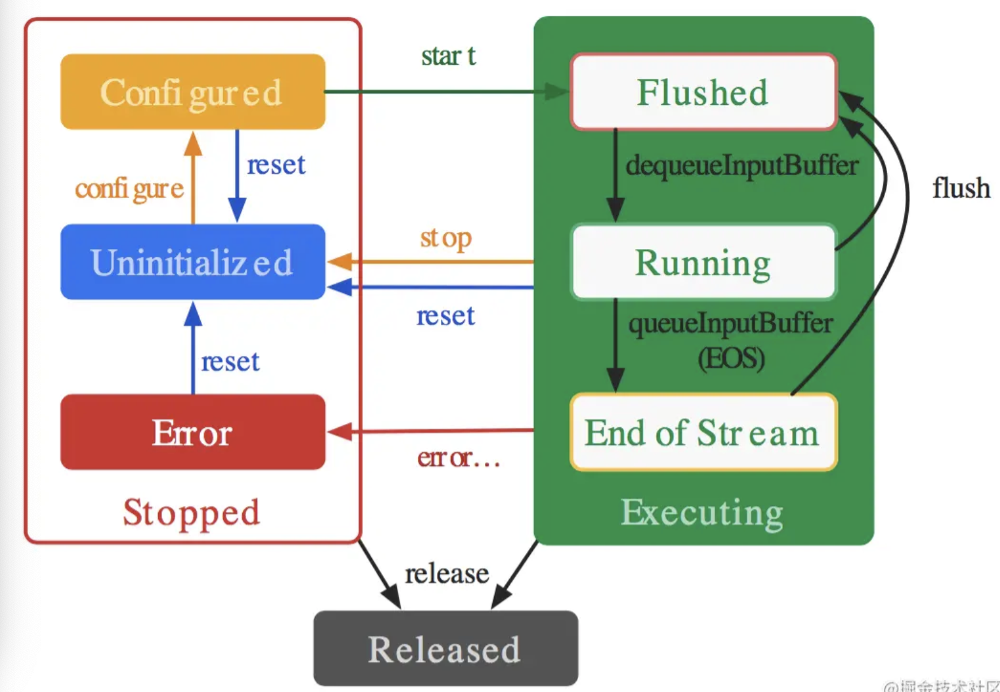
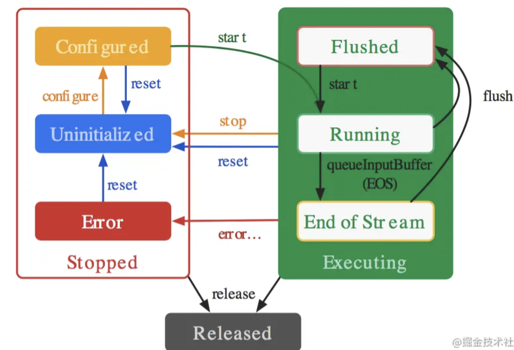

## MediaCodec

### 兼容性问题

- 系统版本性问题
- 设备的差异性
- 相关文件

### 系统版本演变

4.1（16） 第一次可用

4.3（18）MediaCodec被扩展为包含一种通过 Surface 提供输入的方法

5.0（21）引入异步模式

### 生命周期



当第一个inputbufffer从队列中取出时，立即进入Running状态，这个时间很短。然后就可以调用dequeueInputBuffer和getInputBuffer来获取用户可用的缓冲区，用户填满数据后调用queueinputbuffer方法返回给解码器，解码器大部分时间都会工作在Running状态。当想inputbufferqueue中输入一帧标记`EndOfStream`的时候，进入End-of-Stream状态，在这种状态下，解码器不再接受任何新的数据输入，缓冲区中的数据和标记`EndOfStream`最终会执行完毕。

### 基本使用

#### 输入输出模式

- surface模式 —— 输入/输出以surface 作为源

- ByteBuffer 模式—— 输入/输出时以 ByteBuffer 作为源

##### surface模式

使用原视频数据时，最好采用`Surface`作为输入源来替代`ByteBuffer`，这样效率更高，效果更好，因为surface使用的更底层的视频数据，不会映射或者复制到ByteBuffer缓冲区。在使用surface作为输入源时，开发者不能访问到到原始视频数据，但是可以使用`ImageReader`来获取到原始未加密的视频数据，这个地方我理解的是`imagereader`的工作流程是接受自己的surface数据来生成image，将`imagereader`的surface传给`mediacodec`作为解码器的输出surface，就可以访问解码的数据，但是必须是未加密的，这种方式同样比使用`ByteBuffer`更快，因为native缓冲区会直接映射到`directbytebuffer`区域，这是一块native和java共享的缓冲区。

```java
void releaseOutputBuffer (int index,boolean render)
void releaseOutputBuffer (int index,long renderTimestampNs)
```

这两个方法都会释放index所指向的缓冲区。假如使用了surface，第二个参数传入传入true

​	将会把数据先输出给surface，当surface不再使用时立即返回给codec，

传入long型时：
	如果在SurfaceView上渲染缓冲区，则可以使用时间戳在特定时间渲染缓冲区（在缓冲区时间戳之后或之后的VSYNC处）。为了达到这个目的，时间戳需要合理地接近当前的nanoTime（）。

###### 示例程序

#### 异/同步模式

##### 同步模式

dequeueInputBuffer(long timeoutUs)

​	传入的参数为正，则是最长等待时间

​	为0 会立即返回缓冲区的id，-1 则会无限等待。

dequeueOutputBuffer()

- 创建并配置一个 `MediaCodec` 对象
- 循环直到完成:
  如果输入缓冲区就绪，读取一个输入块，并复制到输入缓冲区中，并返还给MediaCodec进行编解码
  如果输出缓冲区就绪，获取输出缓冲区并获取数据
- 释放 `MediaCodec` 对象

##### 异步模式

LOLLIPOP （API 21）

MediaCodec.Callback.OnInputBufferAvailabe()

MediaCodec.Callback.OnInputBufferAvailabe()

###### 生命周期



在running状态时必须在调用 flush() 之后调用 start() 方法，将编解码器转换为Running子状态并开始接收输入缓冲区。 同样，在初始调用开始时，codec 将直接移至 Running 子状态，并通过回调开始传递可用的输入缓冲区。

###### 示例代码

```
MediaCodec codec = MediaCodec.createByCodecName(name);
MediaFormat mOutputFormat; // member variable
codec.setCallback(new MediaCodec.Callback() {
   @Override
   void onInputBufferAvailable(MediaCodec mc, int inputBufferId) {
     ByteBuffer inputBuffer = codec.getInputBuffer(inputBufferId);
     // fill inputBuffer with valid data
     …
     codec.queueInputBuffer(inputBufferId, …);
   }

   @Override
   void onOutputBufferAvailable(MediaCodec mc, int outputBufferId, …) {
     ByteBuffer outputBuffer = codec.getOutputBuffer(outputBufferId);
     MediaFormat bufferFormat = codec.getOutputFormat(outputBufferId); // option A
     // bufferFormat is equivalent to mOutputFormat
     // outputBuffer is ready to be processed or rendered.
     …
     codec.releaseOutputBuffer(outputBufferId, …);
   }

   @Override
   void onOutputFormatChanged(MediaCodec mc, MediaFormat format) {
     // Subsequent data will conform to new format.
     // Can ignore if using getOutputFormat(outputBufferId)
     mOutputFormat = format; // option B
   }

   @Override
   void onError(…) {
     …
   }
 });
 codec.configure(format, …);
 mOutputFormat = codec.getOutputFormat(); // option B
 codec.start();
 // wait for processing to complete
 codec.stop();
 codec.release();

```


#### 常见使用

输入给解码器一帧完整的数据或者从编码器得到一帧完整的数据

```java
//创建MediaCodec
MediaCodec mediaCodec = MediaCodec.createDecoderByType(mime);
//配置
/* configure (MediaFormat format, Surface surface, MediaCrypto crypto, int flags)
	surface
		null：不想将生成的 outputbuffers 渲染到 surface时
	flags	两种模式：
		CONFIGURE_FLAG_ENCODE(1)	为编码模式
		其他为解码模式
*/
mediaCodec.configure(format,null,null,0);
//启动
mediaCodec.start();

//请求一个输入缓存的bufferIndex，形参为 timeoutUs---代表等待时间 -1表示无限等待
int bufferIndex = mediaCodec.dequeueInputBuffer(0);
if(bufferIndex != NO_BUFFER_INDEX){
    //根据 bufferIndex 得到buffer
    ByteBuffer buffer = mediacodec.getInputBuffers()[bufferIndex];
    //在使用前要clear 一下，避免之前的缓存数据影响当前数据
    buffer.clear();
    //给 buffer 中写入数据
    int size = xxx.read(buffer);
    //生成时间戳
    //buffer 入队
    mediaCodec.queueInputBuffer(bufferIndex,
                               0,		//缓冲区提交数据的起始位置
                               size,	//数据长度
                               timestampUS,	//时间戳(微秒)
                               signalEos?MediaCodec.BUFFER_FLAG_END_OF_STREAM:0);
    	/*
    		flag:
    			BUFFER_FLAG_CODEC_CONFIG:配置信息
    			BUFFER_FLAG_END_OF_STREAM:结束标志
    			BUFFER_FLAG_KEY_FRAME:关键帧，不建议使用
    	*/
}


//获取输出
// If we don't have an output buffer, try to get one now.
if(outputBufferIndex == NO_BUFFER_INDEX){
    //请求一个输出缓存，BufferInfo 用于存储 ByteBuffer 的信息
    //此处设为0，不然会存在部分手机卡死在这里
	outputBufferIndex = mediaCodec.dequeue0utputBuffer(outputBufferInfo,0);
}
if (outputBufferIndex == MediaCodec.INFO_OUTPUT_BUFFERS_CHANGED ||
    outputBufferIndex == MediaCodec.INFO_OUTPUT_FORMAT_CHANGED ||
    outputBufferIndex == MediaCodec.INFO_TRY_AGAIN_LATER){
	outputBufferIndex = NO_BUFFER_INDEX;
}else if(outputBufferIndex != NO_BUFFER_INDEX){
    //通过BufferInfo 获取 ByteBuffer 的信息
	eos = (outputBufferInfo.flags &MediaCodec.BUFFER_FLAG_END_OF_STREAM) != 0;
    if(outputBufferInfo.size !=0){
        //输出混乱（比如都是零，或者太短等等）
        outputData.position(outputBufferInfo.offset);
        outputData.limit(outputBufferInfo.offset + outputBufferInfo.size);
    }
	boolean render = outputBufferInfo.size > 0;
    //当App 渲染完一帧图片之后就会调用此函数把buffer 返还给 mediacodec
	mediaCodec.release0utputBuffer(outputBufferIndex, render); //release0utp
	if (render){
        outputSurface.awaitNewImage();
    }
    outputBufferIndex = NO_BUFFER_INDEX;
}
```

##### 指定的特殊数据

AAC audio， MPEG4, H.264， H.265 video格式的数据作为输入源解码的时候，需要指定一个特殊的前缀设置信息，这个信息通常包含在数据中，但是需要自己提取出来，在mediacodec执行start之后提交这些数据，比如h264的sps和pps，在queueinputbuffer的时候flag设置为`BUFFER_FLAG_CODEC_CONFIG`提交给解码器。同样这些数据可以在configure的时候提交给mediacodec，效果和前边的一样:

```java
mediaFormat.setByteBuffer("csd-0", ByteBuffer.wrap(sps));//sps是一个包含sps信息的byte数组
mediaFormat.setByteBuffer("csd-1", ByteBuffer.wrap(pps));//pps是一个包含pps信息的byte数组
```


注意:

​	当提交配置信息后可能flush的时候丢失信息，必须重新提交这个信息。提交信息是时间戳将被忽略。

编码器在收到这些信息后将会同样输出带有`BUFFER_FLAG_CODEC_CONFIG`标记的outputbuffer

##### 加密

queueSecureInputBuffer() 	提交缓冲区

#### 常见问题


