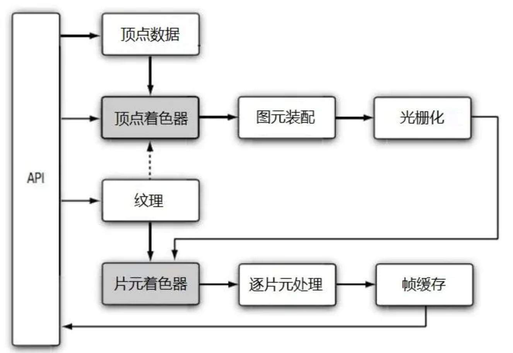
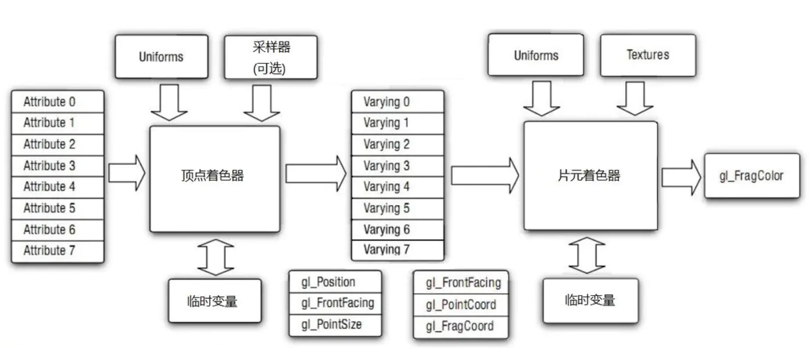
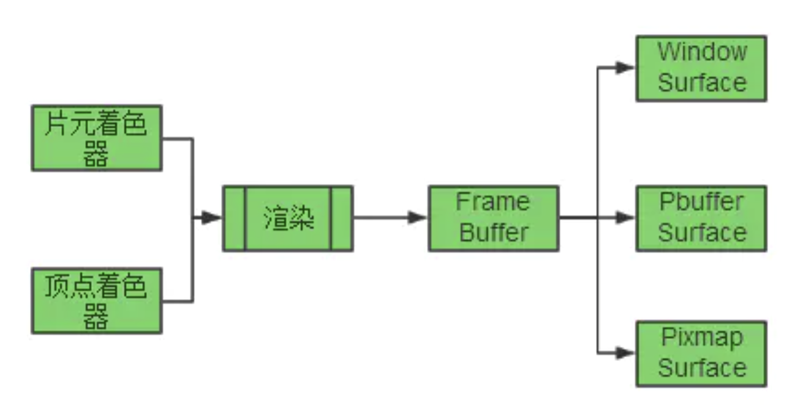

# OpenGL ES

### 基础知识

#### 平面图形

GL_TRIANGLES	三角形	ABCDEF绘制ABC,DEF两个三角形

GL_TRIANGLE_STRIP	三角形带		ABCDEF绘制ABC,BCD,CDE,DEF四个三角形

GL_TRIANGLES_FAN	扇形	ABCDEF绘制ABC、ACD、ADE、AEF四个三角形

#### 纹理过滤模式


OpenGL纹理过滤模式

| GL_NEAREST                | 最近邻过滤                                      |
| ------------------------- | ----------------------------------------------- |
| GL_NEAREST_MIPMAP_NEAREST | 使用MIP贴图的最近邻过滤                         |
| GL_NEAREST_MIPMAP_LINEAR  | 使用MIP贴图的最近邻过滤                         |
| GL_LINEAR                 | 双线性过滤                                      |
| GL_LINEAR_MIPMAP_NEAREST  | 使用MIP贴图的双线性过滤                         |
| GL_LINEAR_MIPMAP_LINEAR   | 三线性过滤(使用MIP贴图级别之间插值的双线性过滤) |

每种情况下允许的纹理过滤模式

| 缩小 | GL_NEAREST <br />GL_NEAREST_MIPMAР_NEAREST <br/>GL_NEAREST_MIPMAР_LINEAR  <br/>GL_LINEAR <br/>GL_LINEAR_MIPMAP_NEAREST <br/>GL_LINEAR_MIPMAP_LINEAR |
| ---- | ------------------------------------------------------------ |
| 放大 | GL_ NEAREST<br/>GL_ LINEAR                                   |

#### 平面图形添加滤镜

##### 灰度图

通过 RGB 计算 Y 值：Gray=R*0.3+G*0.59+B*0.11

着色器代码

```glsl
precision mediump float;
//在片元着色器这里添加这个 sampler2D 表示我们要添加2D贴图
uniform sampler2D u_TextureUnit;
//定义一个u_ChangeColor,因为颜色的变量是RGB,所以使用vec3
uniform vec3 u_ChangeColor;
varying vec2 v_TextureCoordinates;

void main(){
    //得到2d color
    vec4 nColor=texture2D(u_TextureUnit,v_TextureCoordinates);
   //黑白图片
    float c= nColor.r*u_ChangeColor.r+nColor.g*u_ChangeColor.g+nColor.b*u_ChangeColor.b;
    gl_FragColor = vec4(c,c,c,nColor.a);
}
```


```java
//0 创建数组
//黑白图片的公式：RGB 按照 0.2989 R，0.5870 G 和 0.1140 B 的比例构成像素灰度值。
float[] grayFilterColorData = {0.299f, 0.587f, 0.114f};

//1 .得到属性的location
uChangeColor = GLES20.glGetUniformLocation(mProgramObjectId, U_CHANGE_COLOR);

//2. 将数组传入
GLES20.glUniform3fv(uChangeColor, 1, grayFilterColorData, 0);

```

##### 冷暖色调处理

冷色调的处理就是单一增加蓝色通道的值，暖色调的处理可以增加红绿通道的值。

着色器代码

```glsl
 precision mediump float;

//在片元着色器这里添加这个 sampler2D 表示我们要添加2D贴图
uniform sampler2D u_TextureUnit;
//定义一个u_ChangeColor,因为颜色的变量是RGB,所以使用vec3
uniform vec3 u_ChangeColor;
varying vec2 v_TextureCoordinates;

//modifyColor.将color限制在rgb
void modifyColor(vec4 color){
    color.r=max(min(color.r,1.0),0.0);
    color.g=max(min(color.g,1.0),0.0);
    color.b=max(min(color.b,1.0),0.0);
    color.a=max(min(color.a,1.0),0.0);
}

void main(){
    //得到2d color
    vec4 nColor=texture2D(u_TextureUnit,v_TextureCoordinates);
    //简单色彩处理，冷暖色调、增加亮度、降低亮度等
        vec4 deltaColor=nColor+vec4(u_ChangeColor,0.0);
        modifyColor(deltaColor);
        gl_FragColor=deltaColor;
}
```


```java
  //0.添加数组
  //暖色的颜色。是加强R/G来完成。这里注意的是颜色值在[0,1]之间
  float[] warmFilterColorData = {0.1f, 0.1f, 0.0f};
  //冷色系的调整。简单的就是增加B的分量
  float[] coolFilterColorData = {0.0f, 0.0f, 0.1f};

  //1. 和上面一样，得到属性的位置
          uChangeColor = GLES20.glGetUniformLocation(mProgramObjectId, U_CHANGE_COLOR);

  //2.传递值
//暖色调
            GLES20.glUniform3fv(uChangeColor, 1, warmFilterColorData, 0);
//或者。冷色调
            GLES20.glUniform3fv(uChangeColor, 1, coolFilterColorData, 0);

```

##### 图片模糊处理

通常图片模糊处理是采集周边多个点，
然后利用这些点的色彩和这个点自身的色彩进行计算，得到一个新的色彩值作为目标色彩。模糊处理有很多算法，类似高斯模糊、径向模糊等等。

###### 计算高斯模糊

为了计算权重矩阵，需要设定σ的值。假定σ=1.5，则**模糊半径为1**的权重矩阵，权重之和等于1，得到最终的权重矩阵。

对所有点重复这个过程，就得到了高斯模糊后的图像。如果原图是彩色图片，可以对RGB三个通道分别做高斯模糊。
 如果一个点处于边界，周边没有足够的点，怎么办？
 一个变通方法，就是把已有的点拷贝到另一面的对应位置，模拟出完整的矩阵。

```glsl
precision mediump float;

//在片元着色器这里添加这个 sampler2D 表示我们要添加2D贴图
uniform sampler2D u_TextureUnit;

varying vec2 v_TextureCoordinates;

void main(){
    vec4 color = vec4(0.0);
    int coreSize=3;
    int halfSize=coreSize/2;
    float texelOffset = 0.01;
    //创建我们计算好的卷积核
    float kernel[9];
    kernel[6] = 1.0; kernel[7] = 2.0; kernel[8] = 1.0;
    kernel[3] = 2.0; kernel[4] = 4.0; kernel[5] = 2.0;
    kernel[0] = 1.0; kernel[1] = 2.0; kernel[2] = 1.0;
    int index = 0;
    //每一块都进行图像卷积。
    for(int y=0;y<coreSize;y++)
    {
        for(int x = 0;x<coreSize;x++)
        {
            vec4 currentColor = texture2D(u_TextureUnit,v_TextureCoordinates+vec2(float((-1+x))*texelOffset,float((-1+y))*texelOffset));
            color += currentColor*kernel[index];
            index++;
        }
    }
    //归一处理
    color/=16.0;

    gl_FragColor=color;
}
```


### 渲染流程



渲染流程如下：顶点数据(Vertices) > 顶点着色器(Vertex Shader) > 图元装配(Assembly) > 几何着色器(Geometry Shader) > 光栅化(Rasterization) > 片元着色器(Fragment Shader) > 逐片元处理(Per-Fragment Operations) > 帧缓冲(FrameBuffer)。再经过双缓冲的交换(SwapBuffer)，渲染内容就显示到了屏幕上。

光栅化：将图形投影到屏幕上，把图形栅格化成一个个的像素点。一个像素点也就是一个片元。



Attribute：顶点属性，也就是存储顶点的坐标信息(对于着色器只读)
Unifroms：常量，一般存放矩阵变换或者光照之类(对于着色器只读)
Varying：顶点着色器和片元着色器间的通信接口变量，在顶点着色器中写入值(如颜色、纹理坐标等)在片元着色器中读出(对于片元着色器只读)

### 坐标系统

顶点的位置坐标、纹理坐标和屏幕坐标。
位置坐标标识了图元(绘制的物体)放置在哪里；

纹理坐标是图元上如何贴图

屏幕坐标就是这个物体映射到屏幕上的位置

### GLSurfaceView

```java
 // 设置渲染模式为连续模式(会以60fps的速度刷新)  
gls.setRenderMode(GLSurfaceView.RENDERMODE_CONTINUOUSLY);
//设置 opengl es 版本
glSurfaceView.setEGLContextClientVersion(2);
```

还有一种模式为按需刷新模式

### OES

作为预览载体的 SurfaceTexture 绑定的纹理需要是 OES 纹理，即 `GLES11Ext.GL_TEXTURE_EXTERNAL_OES` 纹理，来自于 GLES 的扩展 `#extension GL_OES_EGL_image_external` 中，使用 OES 纹理后，我们不需要在片段着色器中自己做 YUV to RGBA 的转换，因为 OES 纹理可以直接接收 YUV 数据或者直接输出 YUV 数据。

相机的预览实现一般有 2 种方式，一种是基于 Android 原生 SurfaceTexture 的纯 GPU 实现方式，另一种是通过相机的预览回调接口获取帧的 YUV 数据，利用 CPU 算法处理完成之后，传入显存，再利用 GPU 实现 YUV 转 RGBA 进行渲染，即 CPU + GPU 的实现方式。

##### OES 纹理创建的实现

```java
private int createOESTexture(){
    int[] texture = new int[1];
    GLES20.glGenTextures(1, texture, 0);
    GLES20.glBindTexture(GLES11Ext.GL_TEXTURE_EXTERNAL_OES, texture[0]);
    ///线形过滤，min 缩小，mag 放大
    GLES20.glTexParameterf(GLES11Ext.GL_TEXTURE_EXTERNAL_OES,
        GL10.GL_TEXTURE_MIN_FILTER,GL10.GL_LINEAR);
    GLES20.glTexParameterf(GLES11Ext.GL_TEXTURE_EXTERNAL_OES,
        GL10.GL_TEXTURE_MAG_FILTER, GL10.GL_LINEAR);
    //纹理坐标范围是0~1 ，如果设置的值超过1 怎么办？那么就由GL_TEXTURE_WRAP_S、GL_TEXTURE_WRAP_T参数决定怎么做
    GLES20.glTexParameteri(GLES11Ext.GL_TEXTURE_EXTERNAL_OES,
        GL10.GL_TEXTURE_WRAP_S, GL10.GL_CLAMP_TO_EDGE);
    GLES20.glTexParameteri(GLES11Ext.GL_TEXTURE_EXTERNAL_OES,
        GL10.GL_TEXTURE_WRAP_T, GL10.GL_CLAMP_TO_EDGE);
    return texture[0];
}

//激活并绑定
private void onBindTexture() {
    GLES20.glActiveTexture(GLES20.GL_TEXTURE0 + getTextureType());
    GLES20.glBindTexture(GLES11Ext.GL_TEXTURE_EXTERNAL_OES, getTextureId());
    GLES20.glUniform1i(mUTexture, getTextureType());
}

//绘制
GLES20.glDrawArrays(GLES20.GL_TRIANGLE_STRIP, 0, 4);
```

使用 OES 纹理需要修改片段着色器，在着色器脚本的头部增加扩展纹理的声明 `#extension GL_OES_EGL_image_external : require` ，并且纹理采样器不再使用 sample2D ，需要换成 samplerExternalOES 作为纹理采样器。

```glsl
#version 300 es
#extension GL_OES_EGL_image_external : require
precision mediump float;
in vec2 v_texCoord;
uniform samplerExternalOES s_TexSampler;
void main() {
    gl_FragColor = texture(s_TexSampler, v_texCoord);
}
```

### 2D

```c
glBindTexture(GL_TEXTURE_2D, glb->rendTex);
glTexImage2D(GL_TEXTURE_2D, 0, GL_RGBA, (GLsizei)width, (GLsizei)height,
    		 0, GL_BGRA, GL_UNSIGNED_BYTE, (GLvoid *)pixels);
    		 
////绘制
glDrawArrays(GL_TRIANGLE_STRIP, 0, 4);
```


## EGL

EGL是OpenGL ES渲染API和本地窗口系统(native platform window system)之间的一个中间接口层，EGL作为OpenGL ES与显示设备的桥梁，让OpenGL ES绘制的内容能够在呈现当前设备上。它主要由系统制造商实现。

#### 作用

1. 与设备的原生窗口系统通信。
2. 查询绘图表面的可用类型和配置。
3. 创建绘图表面。
4. 在OpenGL ES和其他图形渲染API之间同步渲染。
5. 管理纹理贴图等渲染资源。

#### 属性

|             属性             | 描述                                                         |      默认值       |
| :--------------------------: | ------------------------------------------------------------ | :---------------: |
|       EGL_BUFFER_SIZE        | 颜色缓冲区中所有组成颜色的位数                               |         0         |
|         EGL_RED_SIZE         | 颜色缓冲区中红色位数                                         |         0         |
|        EGL_GREEN_SIZE        | 颜色缓冲区中绿色位数                                         |         0         |
|        EGL_BLUE_SIZE         | 颜色缓冲区中蓝色位数                                         |         0         |
|      EGL_LUMINANCE_SIZE      | 颜色缓冲区中亮度位数                                         |         0         |
|        EGL_ALPHA_SIZE        | 颜色缓冲区中透明度位数                                       |         0         |
|     EGL_ALPHA_MASK_SIZE      | 遮挡缓冲区透明度掩码位数                                     |         0         |
|   EGL_BIND_TO_TEXTURE_RGB    | 绑定到 RGB 贴图使能为真                                      |   EGL_DONT_CARE   |
|   EGL_BIND_TO_TEXTURE_RGBA   | 绑定到 RGBA  贴图使能为真                                    |   EGL_DONT_CARE   |
|    EGL_COLOR_BUFFER_TYPE     | 颜色缓冲区类型 EGL_RGB_BUFFER, 或者EGL_LUMINANCE_BUFFER      |  EGL_RGB_BUFFER   |
|      EGL_CONFIG_CAVEAT       | 配置有关的警告信息                                           |   EGL_DONT_CARE   |
|        EGL_CONFIG_ID         | 唯一的 EGLConfig  标示值                                     |   EGL_DONT_CARE   |
|        EGL_CONFORMANT        | 使用EGLConfig 创建的上下文符合要求时为真                     |         —         |
|        EGL_DEPTH_SIZE        | 深度缓冲区位数                                               |         0         |
|          EGL_LEVEL           | 帧缓冲区水平                                                 |         0         |
|    EGL_MAX_PBUFFER_WIDTH     | 使用EGLConfig 创建的PBuffer的最大宽度                        |         —         |
|    EGL_MAX_PBUFFER_HEIGHT    | 使用EGLConfig 创建的PBuffer最大高度                          |         —         |
|    EGL_MAX_PBUFFER_PIXELS    | 使用EGLConfig 创建的PBuffer最大尺寸                          |         —         |
|    EGL_MAX_SWAP_INTERVAL     | 最大缓冲区交换间隔                                           |   EGL_DONT_CARE   |
|    EGL_MIN_SWAP_INTERVAL     | 最小缓冲区交换间隔                                           |   EGL_DONT_CARE   |
|    EGL_NATIVE_RENDERABLE     | 如果操作系统渲染库能够使用EGLConfig  创建渲染渲染窗口        |   EGL_DONT_CARE   |
|     EGL_NATIVE_VISUAL_ID     | 与操作系统通讯的可视ID句柄                                   |   EGL_DONT_CARE   |
|    EGL_NATIVE_VISUAL_TYPE    | 与操作系统通讯的可视ID类型                                   |   EGL_DONT_CARE   |
|     EGL_RENDERABLE_TYPE      | 渲染窗口支持的布局组成标示符的遮挡位EGL_OPENGL_ES_BIT, EGL_OPENGL_ES2_BIT, orEGL_OPENVG_BIT that | EGL_OPENGL_ES_BIT |
|      EGL_SAMPLE_BUFFERS      | 可用的多重采样缓冲区位数                                     |         0         |
|         EGL_SAMPLES          | 每像素多重采样数                                             |         0         |
|      EGL_S TENCIL_SIZE       | 模板缓冲区位数                                               |         0         |
|       EGL_SURFACE_TYPE       | EGL 窗口支持的类型EGL_WINDOW_BIT, EGL_PIXMAP_BIT,或EGL_PBUFFER_BIT |  EGL_WINDOW_BIT   |
|     EGL_TRANSPARENT_TYPE     | 支持的透明度类型                                             |     EGL_NONE      |
|  EGL_TRANSPARENT_RED_VALUE   | 透明度的红色解释                                             |   EGL_DONT_CARE   |
| EGL_TRANSPARENT_GRE EN_VALUE | 透明度的绿色解释                                             |   EGL_DONT_CARE   |
|  EGL_TRANSPARENT_BLUE_VALUE  | 透明度的兰色解释                                             |   EGL_DONT_CARE   |

### 概念

#### 常见概念

EGLDisplay ：系统显示 ID 或句柄，可以理解为一个前端的显示窗口
EGLConfig ：Surface的EGL配置，可以理解为绘制目标 framebuffer 的配置属性
EGLSurface ：系统窗口或 frame buffer 句柄 ，可以理解为一个后端的渲染目标窗口。
EGLContext ：OpenGL ES 图形上下文，它代表了OpenGL状态机；如果没有它，OpenGL指令就没有执行的环境。

这几个类型在不同平台其实现是不同的，EGL只提供抽象标准。

NativeDisplayType： Native 系统显示类型，标识你所开发设备的物理屏幕

NativeWindowType ： Native 系统窗口缓存类型，标识系统窗口

NativePixmapType ：Native 系统 frame buffer，可以作为 Framebuffer 的系统图像（内存）数据类型，该类型只用于离屏渲染

#### EGLSurface

EGLSurface 可以是由 EGL 分配的离屏缓冲区（称为“pbuffer”），或由操作系统分配的窗口。EGL 窗口 Surface 通过 eglCreateWindowSurface() 调用被创建。该调用将“窗口对象”作为参数，在 Android 上，该对象可以是 SurfaceView、SurfaceTexture、SurfaceHolder 或 Surface，所有这些对象下面都有一个 BufferQueue。当您进行此调用时，EGL 将创建一个新的 EGLSurface 对象，并将其连接到窗口对象的 BufferQueue 的生产方接口。此后，渲染到该 EGLSurface 会导致一个缓冲区离开队列、进行渲染，然后排队等待消耗方使用。

EGL 不提供锁定/解锁调用，而是由您发出绘制命令，然后调用 eglSwapBuffers() 来提交当前帧。

一个 Surface 一次只能与一个 **EGLSurface** 关联（您只能将一个生产方连接到一个 BufferQueue），但是如果您销毁该 EGLSurface，它将与该 BufferQueue 断开连接，并允许其他内容连接到该 BufferQueue。

通过更改“当前”EGLSurface，指定线程可在多个 EGLSurface 之间进行切换。一个 EGLSurface 一次只能在一个线程上处于当前状态。

另外两种Surface：PixmapSurface和PBufferSurface，这两种都不是可显示的Surface，PixmapSurface是保存在系统内存中的位图，PBuffer则是保存在显存中的帧。
 对于这两种surface，Android系统中，支持PBufferSurface。

- WindowSurface
  顾名思义WindowSurface是和窗口相关的，也就是在屏幕上的一块显示区的封装，渲染后即显示在界面上。
- PbufferSurface
  在显存中开辟一个空间，将渲染后的数据(帧)存放在这里。
- PixmapSurface
  以位图的形式存放在内存中，据说各平台的支持不是很好。



##### PBufferSurface

```java
final int[] attributes = {
    EGL14.EGL_WIDTH,surface.viewport.width,
    EGL14.EGL_HEIGHT,surface.viewport.height,EGL14.EGL_NONE};
// 创建失败时返回EGL14.EGL_NO_SURFACE
surface.eglSurface = EGL14.eglCreatePbufferSurface(eglDisplay, eglConfig, attributes, 0);

//获取 PbufferBuffer 的内容，数据格式需要转换，扫描方向和颜色格式不一致
IntBuffer ib=IntBuffer.allocate(512*512);
GLES20.glReadPixels(0,0,512,512,GL10.GL_RGBA,GL10.GL_UNSIGNED_BYTE,ib);
final Bitmap bitmap = frameToBitmap(512, 512, ib);
new Handler(Looper.getMainLooper()).post(new Runnable(){
    @Override
    public void run(){
        imageIv.setImageBitmap(bitmap);
    }
});
```


### 使用

#### 步骤

- 创建连接

  ```java
  //创建连接
  EGLDisplay eglDisplay(EGLNativeDisplayType displayId);
  ```

  ​	`displayId` 指定显示连接，一般使用默认的 `EGL_DEFAULT_DISPLAY`，即返回与默认原生窗口的连接

  错误码

  ​	EGL_NO_DISPLAY ：连接不可用

- 初始化连接

  ```java
  EGLBoolean eglInitialize(EGLDisplay display, //创建步骤时返回的对象
  	EGLint *majorVersion, //返回EGL主版本号
  	EGLint *minorVersion); //返回EGL次版本号
  ```

  相关错误码

  - EGL_NO_DISPLAY ：EGL 不能初始化
  - EGL_BAD_DISPLAY ：没有指定有效的 display

- 获取配置

  一旦初始化了EGL，就可以确定可用渲染表面的类型和配置了。有两种方法：

  - 先使用 `eglGetConfigs` 查询每个配置，再使用 `eglGetConfigAttrib` 找出最好的选择

  - 指定一组需求，使用 `eglChooseChofig` 让 EGL 推荐最佳配置
  
  `EGLConfig` 包含了渲染表面的所有信息，包括可用颜色、缓冲区等其他特性。
  
  **取所有配置的函数**
  
  ```java
  EGLBoolean eglGetConfigs(EGLDisplay display, //指定显示的连接
  EGLConfig *configs, //指定GLConfig列表
  EGL int maxReturnConfigs,//最多返回的GLConfig数组
  EGL int *numConfigs);//实际返回的GLConfig数
  ```
  
  **查询 EGLConfig 配置**
  
  ```java
  EGLBoolean eglGetConfigAttrib(EGLDisplay display,	//指定显示的连接
  	EGLConfig config,//指定要查询的GLConfig
  	EGL int attribute,//返回特定属性
  	EGLint *value);//返回值
  ```
  
  **让 EGL 选择配置**
  
  ```java
  EGL Boolean eglChooseChofig(EGLDispay display,//指定显示的连接
  	const EGLint *attribList,	//指定configs 匹配的属性列表，可以为NULL
  	EGLConfig *config,	//调用成功，返会符合条件的EGLConfig列表
  	EGLint maxReturnConfigs,	//最多返回的符合条件的 EGLConfig数
  	ELGint *numConfigs);	//实际返回的符合条件的 EGLConfig数
  ```
  
  如果 `eglChooseChofig` 成功返回，则返回一组匹配你的标准的 `EGLConfig`。
  
- 创建渲染区域

  当有了符合条件的 `EGLConfig` 后，就可以通过 `eglCreateWindowSurface` 函数创建渲染区域。

  ```java
  EGLSurface eglCreateWindowSurface(EGLDisplay display,	//指定显示的连接
  	EGLConfig config,	//符合条件的EGLConfig
  	EGLNatv ieWindowType window,	//指定原生窗口
  	const EGLint *attribList);	//指定窗口属性列表，可为NULL
  ```

  相关错误码：
  	EGL_BAD_MATCH ：提供了与窗口属性不匹配的 EGLConfig，或该 EGLConfig 不支持渲染到窗口
  	EGL_BAD_CONFIG ：提供的 EGLConfig 没有得到系统支持
  	EGL_BAD_NATIVE_WINDOW ：提供的原生窗口句柄无效
  	EGL_BAD_ALLOC ：无法为新的窗口分配资源，或已经有和提供的原生窗口关联的 EGLConfig

- 创建渲染上下文

  上下文包含了操作所需的所有状态信息，OpenGL ES 3.0 必须有一个可用的上下文才能进行绘图

  ```java
  EGLContext eglCreateContext(EGLDisplay display,//指定显示的连接
  	EGLConfig config,//前面选好的EGLConfig
  	EGLContext shareContext,//允许其它EGLContext共享数据，使用EGL_NO_CONTEXT 表示不共享
  	const EGLint* attribList);	//指定操作的属性列表，只能接受一个属性EGL_CONTEXT_CLIENT_VERSION
  ```

  

- 关联上下文和渲染区域

  指定某个 `EGLContext` 为当前上下文，关联特定的 `EGLContext` 和 `EGLSurface`

  ```java
  EGLBoolean egLMakeCurrent(EGLDisplay display, //指定显示的连接
  	EGLSurface draw, // EGL绘图表面
  	EGLSurface read, // EGL读取表面
  	EGLContext context); //指定连接到该表面的上下文
  ```

  这里存在两个 `EGLSurface`，具有更好的灵活性，在后续一些高级的 EGL 用法中将利用它。目前我们先把它们设置为同一个值。

- 切换 front buffer 和 back buffer 送显      

  eglSwapBuffer()

#### 示例代码

```java
public class GLRenderer extends HandlerThread{
    private static final String TAG = "GLThread";
    private EGLConfig eglConfig = null;
    private EGLDisplay eglDisplay = EGL14.EGL_NO_DISPLAY;
    private EGLContext eglContext = EGL14.EGL_NO_CONTEXT;

    private int program;
    private int vPosition;
    private int uColor;

    public GLRenderer() {
        super("GLRenderer");
    }

    /**
     * 创建OpenGL环境
     */
    private void createGL(){
        // 获取显示设备(默认的显示设备)
        eglDisplay = EGL14.eglGetDisplay(EGL14.EGL_DEFAULT_DISPLAY);
        // 初始化
        int []version = new int[2];
        if (!EGL14.eglInitialize(eglDisplay, version,0,version,1)) {
            throw new RuntimeException("EGL error "+EGL14.eglGetError());
        }
        // 获取FrameBuffer格式和能力
        int []configAttribs = {
                EGL14.EGL_BUFFER_SIZE, 32,
                EGL14.EGL_ALPHA_SIZE, 8,
                EGL14.EGL_BLUE_SIZE, 8,
                EGL14.EGL_GREEN_SIZE, 8,
                EGL14.EGL_RED_SIZE, 8,
                EGL14.EGL_RENDERABLE_TYPE, EGL14.EGL_OPENGL_ES2_BIT,
                EGL14.EGL_SURFACE_TYPE, EGL14.EGL_WINDOW_BIT,
                EGL14.EGL_NONE
        };
        int []numConfigs = new int[1];
        EGLConfig[]configs = new EGLConfig[1];
        if (!EGL14.eglChooseConfig(eglDisplay, configAttribs,0, configs, 0,configs.length, numConfigs,0)) {
            throw new RuntimeException("EGL error "+EGL14.eglGetError());
        }
        eglConfig = configs[0];
        // 创建OpenGL上下文
        int []contextAttribs = {
                EGL14.EGL_CONTEXT_CLIENT_VERSION, 2,
                EGL14.EGL_NONE
        };
        eglContext = EGL14.eglCreateContext(eglDisplay, eglConfig, EGL14.EGL_NO_CONTEXT, contextAttribs,0);
        if(eglContext== EGL14.EGL_NO_CONTEXT) {
            throw new RuntimeException("EGL error "+EGL14.eglGetError());
        }
    }

    /**
     * 销毁OpenGL环境
     */
    private void destroyGL(){
        EGL14.eglDestroyContext(eglDisplay, eglContext);
        eglContext = EGL14.EGL_NO_CONTEXT;
        eglDisplay = EGL14.EGL_NO_DISPLAY;
    }

    @Override
    public synchronized void start() {
        super.start();

        new Handler(getLooper()).post(new Runnable() {
            @Override
            public void run() {
                createGL();
            }
        });
    }

    public void release(){
        new Handler(getLooper()).post(new Runnable() {
            @Override
            public void run() {
                destroyGL()；
                quit();
            }
        });
    }

	///****** OpenGL ES 相关代码见 OpenGL ES java 示例代码 ********////
    
    
    public void render(Surface surface, int width, int height){
        final int[] surfaceAttribs = { EGL14.EGL_NONE };
        EGLSurface eglSurface = EGL14.eglCreateWindowSurface(eglDisplay, eglConfig, surface, surfaceAttribs, 0);
        EGL14.eglMakeCurrent(eglDisplay, eglSurface, eglSurface, eglContext);

        // 初始化着色器
        // 基于顶点着色器与片元着色器创建程序
        program = createProgram(verticesShader, fragmentShader);
        ///..... 中间代码见 OpenGL ES java 示例代码
        // 绘制
        GLES20.glDrawArrays(GLES20.GL_TRIANGLE_STRIP, 0, 3);

        // 交换显存(将surface显存和显示器的显存交换)
        EGL14.eglSwapBuffers(eglDisplay, eglSurface);

        EGL14.eglDestroySurface(eglDisplay, eglSurface);
    }
}


///// 调用
glRenderer.render(surfaceHolder.getSurface(),width,height);
```


### 多线程开发

要在多个线程中使用OpenGL ES开发，需先了解一些状态机的概念，其实很简单。前面在创建EGL环境的时候有个eglContext的概念，这个EGL环境的上下文，可在不同线程共享，切换线程的时候通过这个context调用eglMakeCurrent即可使用当前拥有的program一次包装好的滤镜对象。


## 着色器语言

```glsl
// 顶点着色器
uniform mat4 viewMatrix;    // 从CPU传进来的常量属性，一般放矩阵(矩阵变换-平移、旋转、缩放...) 、光照参数或者颜色
attribute vec4 a_position;  // 顶点属性(位置)，顶点着色器特有的(位置、法线、贴图坐标和颜色数据)
attribute vec2 a_texCoord0; // 顶点属性(贴图坐标)
varying vec2 v_texCoord;    // 变体(随便翻译的)，顶点着色器和片元着色器公有，用于着色器间交互(如传递纹理坐标)
const float myFloat;        // 常量，和C语音一样，固定一个值不可变

void main(void) { 
      gl_Position = u_matViewProjection * a_position; 
      v_texCoord = a_texCoord0;  
} 

// 片元着色器
precision mediump float;       // 此句是声明float的默认精度是中等(片元着色器没默认值，所以需要声明，顶点着色器默认中等)
varying vec2 v_texCoord;       // 和顶点着色器做同样的声明
uniform sampler2D s_baseMap;   // 2D贴图采样器，基础贴图(暂不关心)
uniform sampler2D s_lightMap;  // 2D贴图采样器，光照贴图(暂不关心)                                              
void main(){                                                                                                       
      vec4 base Color;                                                                       
      vec4 lightColor;                                                                     
                                                                                                         
      baseColor = texture2D(s_baseMap, v_texCoord);       
      lightColor = texture2D(s_lightMap, v_texCoord);   
      gl_FragColor = baseColor * (lightColor + 0.25);       
}
```

## 示例代码

### java

```java
public class MyRenderer implements GLSurfaceView.Renderer {
    private int program;
    private int vPosition;
    private int uColor;

    /**
     * 加载制定shader的方法
     * @param shaderType shader的类型  GLES20.GL_VERTEX_SHADER   GLES20.GL_FRAGMENT_SHADER
     * @param sourceCode shader的脚本
     * @return shader索引
     */
    private int loadShader(int shaderType,String sourceCode) {
        // 创建一个新shader
        int shader = GLES20.glCreateShader(shaderType);
        // 若创建成功则加载shader
        if (shader != 0) {
            // 加载shader的源代码
            GLES20.glShaderSource(shader, sourceCode);
            // 编译shader
            GLES20.glCompileShader(shader);
            // 存放编译成功shader数量的数组
            int[] compiled = new int[1];
            // 获取Shader的编译情况
            GLES20.glGetShaderiv(shader, GLES20.GL_COMPILE_STATUS, compiled, 0);
            if (compiled[0] == 0) {//若编译失败则显示错误日志并删除此shader
                Log.e("ES20_ERROR", "Could not compile shader " + shaderType + ":");
                Log.e("ES20_ERROR", GLES20.glGetShaderInfoLog(shader));
                GLES20.glDeleteShader(shader);
                shader = 0;
            }
        }
        return shader;
    }

    /**
     * 创建shader程序的方法
     */
    private int createProgram(String vertexSource, String fragmentSource) {
        //加载顶点着色器
        int vertexShader = loadShader(GLES20.GL_VERTEX_SHADER, vertexSource);
        if (vertexShader == 0) {
            return 0;
        }

        // 加载片元着色器
        int pixelShader = loadShader(GLES20.GL_FRAGMENT_SHADER, fragmentSource);
        if (pixelShader == 0) {
            return 0;
        }

        // 创建程序
        int program = GLES20.glCreateProgram();
        // 若程序创建成功则向程序中加入顶点着色器与片元着色器
        if (program != 0) {
            // 向程序中加入顶点着色器
            GLES20.glAttachShader(program, vertexShader);
            // 向程序中加入片元着色器
            GLES20.glAttachShader(program, pixelShader);
            // 链接程序
            GLES20.glLinkProgram(program);
            // 存放链接成功program数量的数组
            int[] linkStatus = new int[1];
            // 获取program的链接情况
            GLES20.glGetProgramiv(program, GLES20.GL_LINK_STATUS, linkStatus, 0);
            // 若链接失败则报错并删除程序
            if (linkStatus[0] != GLES20.GL_TRUE) {
                Log.e("ES20_ERROR", "Could not link program: ");
                Log.e("ES20_ERROR", GLES20.glGetProgramInfoLog(program));
                GLES20.glDeleteProgram(program);
                program = 0;
            }
        }
        return program;
    }

    /**
     * 获取图形的顶点
     * 特别提示：由于不同平台字节顺序不同数据单元不是字节的一定要经过ByteBuffer
     * 转换，关键是要通过ByteOrder设置nativeOrder()，否则有可能会出问题
     *
     * @return 顶点Buffer
     */
    private FloatBuffer getVertices() {
        float vertices[] = {
                0.0f,   0.5f,
                -0.5f, -0.5f,
                0.5f,  -0.5f,
        };

        // 创建顶点坐标数据缓冲
        // vertices.length*4是因为一个float占四个字节
        ByteBuffer vbb = ByteBuffer.allocateDirect(vertices.length * 4);
        vbb.order(ByteOrder.nativeOrder());             //设置字节顺序
        FloatBuffer vertexBuf = vbb.asFloatBuffer();    //转换为Float型缓冲
        vertexBuf.put(vertices);                        //向缓冲区中放入顶点坐标数据
        vertexBuf.position(0);                          //设置缓冲区起始位置

        return vertexBuf;
    }

    /**
     * 当GLSurfaceView中的Surface被创建的时候(界面显示)回调此方法，一般在这里做一些初始化
     * @param gl10 1.0版本的OpenGL对象，这里用于兼容老版本，用处不大
     * @param eglConfig egl的配置信息(GLSurfaceView会自动创建egl，这里可以先忽略)
     */
    @Override
    public void onSurfaceCreated(GL10 gl10, EGLConfig eglConfig) {
        // 初始化着色器
        // 基于顶点着色器与片元着色器创建程序
        program = createProgram(verticesShader, fragmentShader);
        // 获取着色器中的属性引用id(传入的字符串就是我们着色器脚本中的属性名)
        vPosition = GLES20.glGetAttribLocation(program, "vPosition");
        uColor = GLES20.glGetUniformLocation(program, "uColor");

        // 设置clear color颜色RGBA(这里仅仅是设置清屏时GLES20.glClear()用的颜色值而不是执行清屏)
        GLES20.glClearColor(1.0f, 0, 0, 1.0f);
    }

    /**
     * 当GLSurfaceView中的Surface被改变的时候回调此方法(一般是大小变化)
     * @param gl10 同onSurfaceCreated()
     * @param width Surface的宽度
     * @param height Surface的高度
     */
    @Override
    public void onSurfaceChanged(GL10 gl10, int width, int height) {
        // 设置绘图的窗口(可以理解成在画布上划出一块区域来画图)
        GLES20.glViewport(0,0,width,height);
    }

    /**
     * 当Surface需要绘制的时候回调此方法
     * 根据GLSurfaceView.setRenderMode()设置的渲染模式不同回调的策略也不同：
     * GLSurfaceView.RENDERMODE_CONTINUOUSLY : 固定一秒回调60次(60fps)
     * GLSurfaceView.RENDERMODE_WHEN_DIRTY   : 当调用GLSurfaceView.requestRender()之后回调一次
     * @param gl10 同onSurfaceCreated()
     */
    @Override
    public void onDrawFrame(GL10 gl10) {
        // 获取图形的顶点坐标
        FloatBuffer vertices = getVertices();

        // 清屏
        GLES20.glClear(GLES20.GL_DEPTH_BUFFER_BIT | GLES20.GL_COLOR_BUFFER_BIT);

        // 使用某套shader程序
        GLES20.glUseProgram(program);
        // 为画笔指定顶点位置数据(vPosition)
        GLES20.glVertexAttribPointer(vPosition, 2, GLES20.GL_FLOAT, false, 0, vertices);
        // 允许顶点位置数据数组
        GLES20.glEnableVertexAttribArray(vPosition);
        // 设置属性uColor(颜色 索引,R,G,B,A)
        GLES20.glUniform4f(uColor, 0.0f, 1.0f, 0.0f, 1.0f);
        // 绘制
        GLES20.glDrawArrays(GLES20.GL_TRIANGLE_STRIP, 0, 3);
    }

    // 顶点着色器的脚本
    private static final String verticesShader
            = "attribute vec2 vPosition;            \n" // 顶点位置属性vPosition
            + "void main(){                         \n"
            + "   gl_Position = vec4(vPosition,0,1);\n" // 确定顶点位置
            + "}";

    // 片元着色器的脚本
    private static final String fragmentShader
            = "precision mediump float;         \n" // 声明float类型的精度为中等(精度越高越耗资源)
            + "uniform vec4 uColor;             \n" // uniform的属性uColor
            + "void main(){                     \n"
            + "   gl_FragColor = uColor;        \n" // 给此片元的填充色
            + "}";
}
```

