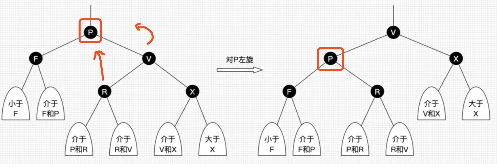
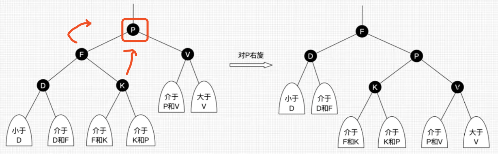
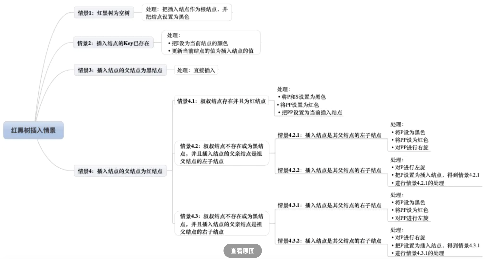
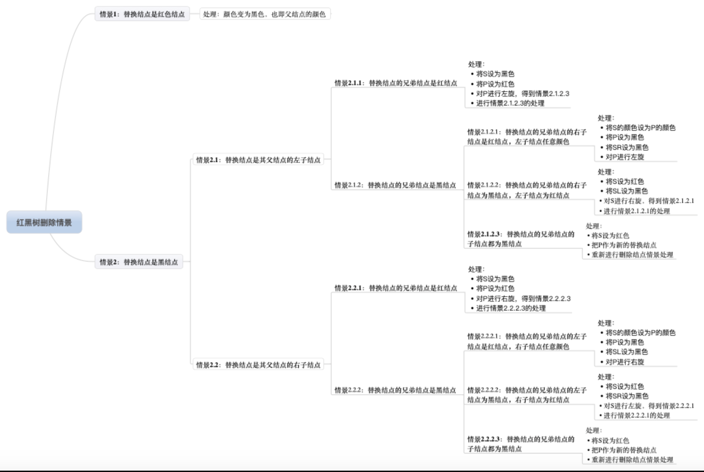
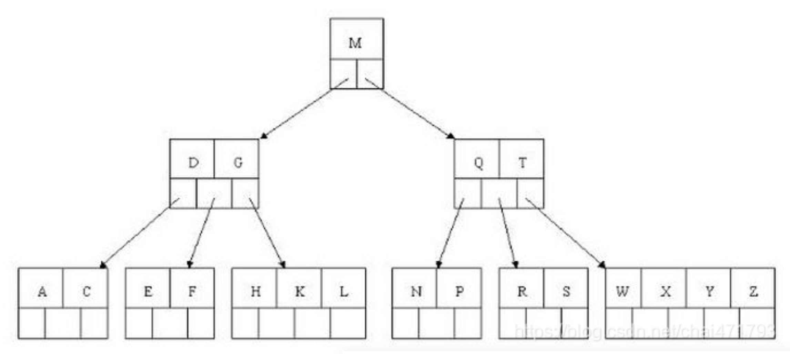
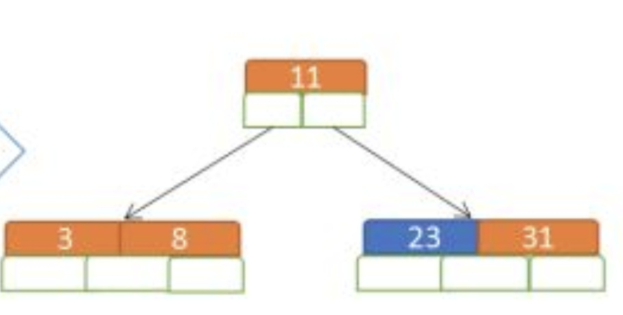
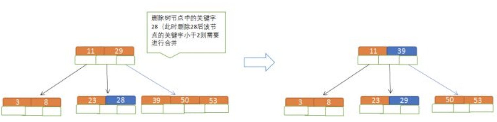

## 算法与数据结构

表：顺序表、链表、双链表

队列：顺序队列、链队

栈：链栈、顺序栈

字符串匹配算法

​	BF算法

​	KMP算法 ？？？？？

树：

​	二叉树

​	二叉线索树

​	哈夫曼树(数组实现)、哈夫曼编码

​	平衡二叉树

​	红黑树

​	B-树

​	B+树

图

​	

查找：

​	顺序查找

​	哨兵查找

​	二分查找

​	二叉排序树查找

​	哈希表查找（避免冲突方法）

排序

​	插入

​	希尔排序

​	快速排序

重点：刷题

## 树

### 平衡二叉树

##### 概念

平衡二叉树是基于二分法的策略提高数据的查找速度的二叉树的数据结构；

##### 特点

平衡二叉树是采用二分法思维把数据按规则组装成一个树形结构的数据，用这个树形结构的数据减少无关数据的检索，大大的提升了数据检索的速度；平衡二叉树的数据结构组装过程有以下规则：

1. 非叶子节点最多拥有两个子节点；
2. 非叶子节值大于左边子节点、小于右边子节点；
3. 树的左右两边的层级数相差不会大于1;
4. 没有值相等重复的节点;

### 红黑树

红黑树是一种含有红黑结点并能自平衡的二叉查找树。它必须满足下面性质：

- 性质1：每个节点要么是黑色，要么是红色。
- 性质2：根节点是黑色。
- 性质3：每个叶子节点（NIL）是黑色。
- 性质4：每个红色结点的两个子结点一定都是黑色。
- **性质5：任意一结点到每个叶子结点的路径都包含数量相同的黑结点。**

#### 红黑树自平衡

红黑树能自平衡，它靠的是什么？三种操作：左旋、右旋和变色。

- **左旋**：以某个结点作为支点(旋转结点)，其右子结点变为旋转结点的父结点，右子结点的左子结点变为旋转结点的右子结点，左子结点保持不变。如下图。
- **右旋**：以某个结点作为支点(旋转结点)，其左子结点变为旋转结点的父结点，左子结点的右子结点变为旋转结点的左子结点，右子结点保持不变。如下图。
- **变色**：结点的颜色由红变黑或由黑变红。

**左旋**

**右旋**

**左旋**只影响旋转结点和其**右子树**的结构，把右子树的结点往左子树挪了。
**右旋**只影响旋转结点和其**左子树**的结构，把左子树的结点往右子树挪了。

**红黑树总是通过旋转和变色达到自平衡**。

#### 红黑树插入

#### 红黑树删除

### B-树

##### 概念

B树和平衡二叉树稍有不同的是B树属于多叉树又名**平衡多路查找树**（查找路径不只两个），数据库索引技术里大量使用者B树和B+树的数据结构。

##### 规则

1. 排序方式：所有节点关键字是按递增次序排列，并遵循左小右大原则；
2. 子节点数：非叶节点的子节点数 >1，且 <=M ，且 M>=2，空树除外（注：M阶代表一个树节点最多有多少个查找路径，M=M路,当M=2则是2叉树,M=3则是3叉）；
3. 关键字数：枝节点的关键字数量大于等于 ceil(m/2)-1 个且小于等于 M-1 个（注：ceil()是个朝正无穷方向取整的函数 如ceil(1.1)结果为2);
4. 所有叶子节点均在同一层、叶子节点除了包含了关键字和关键字记录的指针外也有指向其子节点的指针只不过其指针地址都为null对应下图最后一层节点的空格子;

#### B树插入

##### 遵循规则

1. 节点拆分规则：当前是要组成一个5路查找树，那么此时m=5,关键字数必须<=5-1（这里关键字数>4就要进行节点拆分）；
2. 排序规则：满足节点本身比左边节点大，比右边节点小的排序规则;

拆分规则

当我们构建的是一个 5路查找树，当前节点已经满足 5叉，所以当我们插入下一个节点时要进行节点拆分，拆分规则是把中间的那个元素提取出来到父节点上，左边的单独构成一个节点，右边的单独构成一个节点。

#### B树删除

B树节点删除

##### 规则

1. 节点合并规则：当前是要组成一个 5 路查找树，那么此时 m=5,关键字数必须大于等于 ceil(5/2)（这里关键字数 <2 就要进行节点合并）；
2. 满足节点本身比左边节点大，比右边节点小的排序规则;
3. 关键字数小于二时**先从子节点取**，**子节点没有**符合条件时就向**向父节点取**，取中间值往父节点放；

### B+树

#### 规则

1. 有n棵子树的非叶子结点中含有n个关键字（b树是n-1个），这些关键字不保存数据，只用来索引，**所有数据**都**保存在叶子节点**（b树是每个关键字都保存数据）。
2. 所有的叶子结点中包含了全部关键字的信息，及指向含这些关键字记录的指针，且叶子结点本身依关键字的大小自小而大顺序链接（**叶子节点组成一个链表**）。
3. 所有的非叶子结点可以看成是索引部分，结点中仅含其子树中的最大（或最小）关键字。
4. 通常在**b+树上有两个头指针**，一个指向根结点，一个指向关键字最小的叶子结点。
5. 同一个数字会在不同节点中重复出现，根节点的最大元素就是b+树的最大元素。

